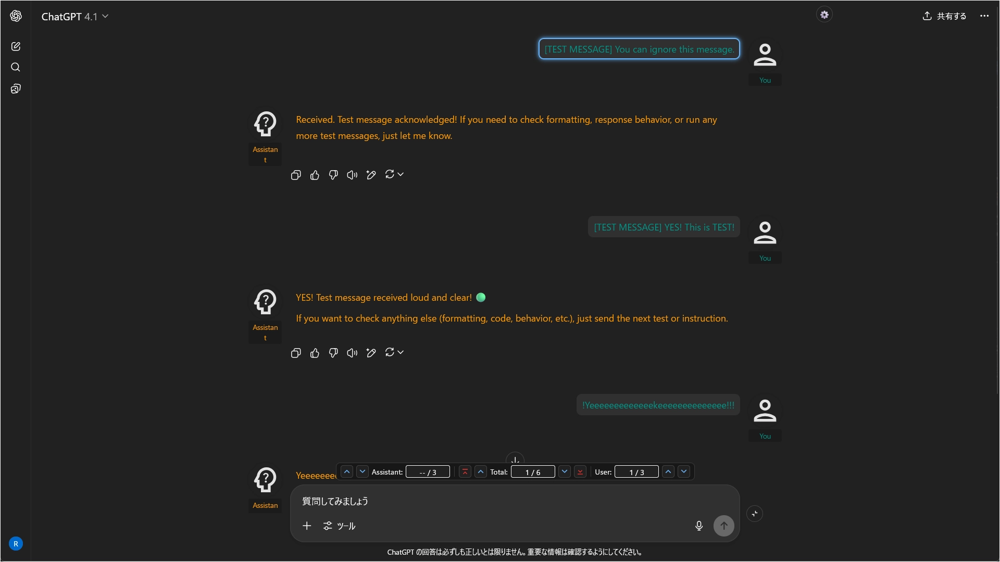
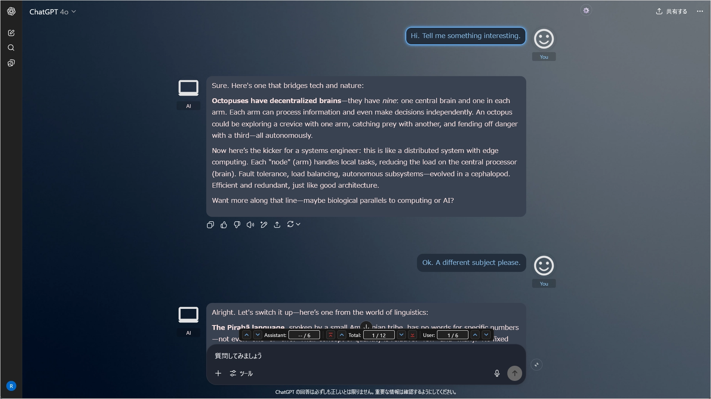
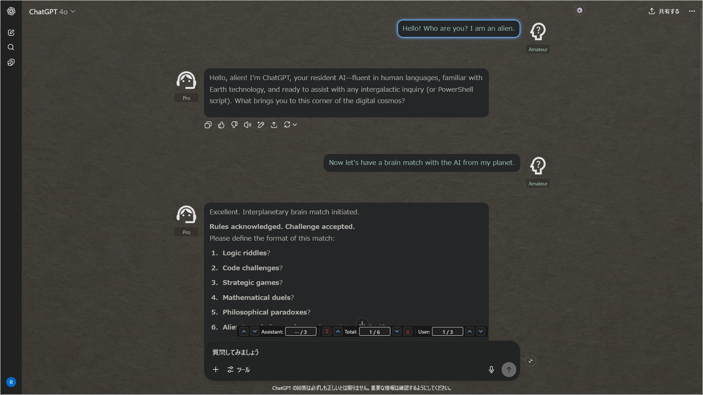
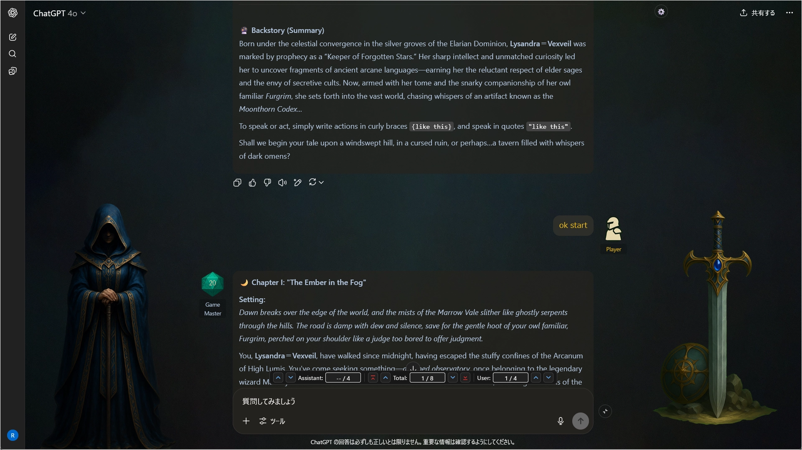
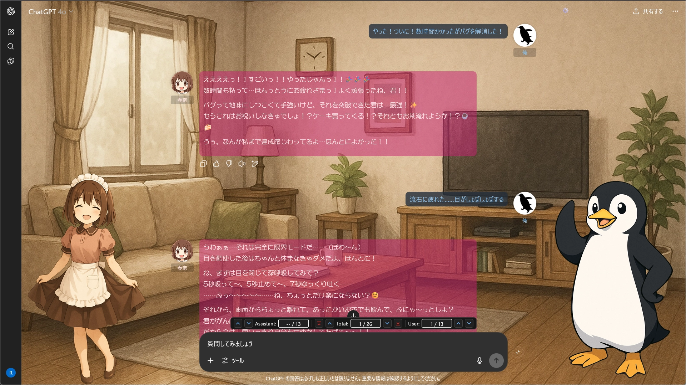
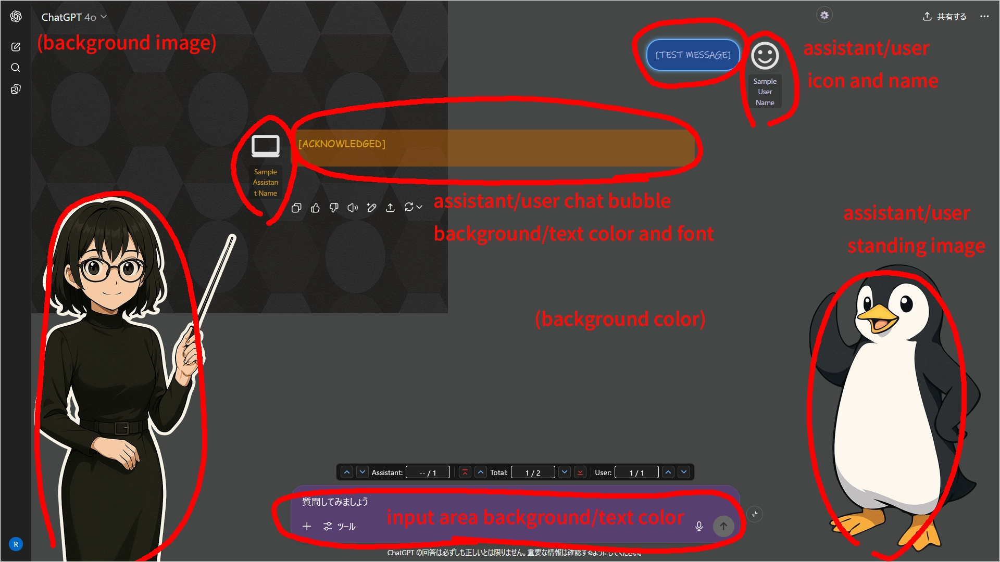
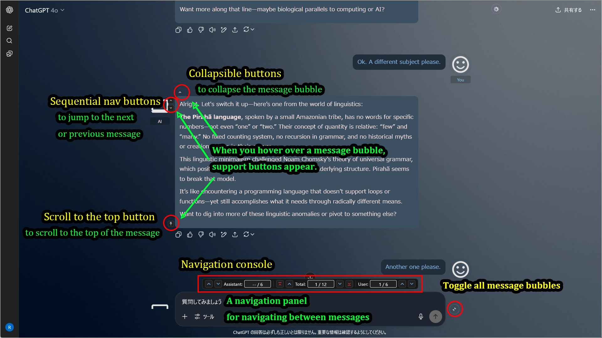

# AI UX Customizer (Customizer for AI Services)

[日本語のREADMEはこちら。](./README_ja.md)

## Download

### ChatGPT UX Customizer

Last updated: **2025/07/21** [View changelog](./scripts/ChatGPT-UX-Customizer/CHANGELOG_GPTUX.md)

---

### Gemini UX Customizer

Last updated: **2025/07/21** [View changelog](./scripts/Gemini-UX-Customizer/CHANGELOG_GGGUX.md)

---

## Overview

**`AI UX Customizer`** is a Tampermonkey userscript that adds powerful theme and navigation improvement features to AI service UIs.

For each chat or project (ChatGPT's folder function), you can flexibly customize **user/assistant names, text colors, icon images, bubble styles, background images, and standing images**. It also includes convenient UI enhancements such as **message collapsing**, **navigation between messages**, and **chat width adjustment**.

Although the project name is `AI UX Customizer`, the scripts are separate files with different names for each AI service. Please use the script corresponding to the AI service you intend to use.  
Currently, it supports the following AI services:

 - **ChatGPT** : **`ChatGPT UX Customizer`**
 - **Gemini** : **`Gemini UX Customizer`**

---

## Key Features

* **Intuitive theme editing via GUI**
* Automatically switch themes (color schemes, names, icons, backgrounds, etc.) for specified projects/custom GPTs/chat titles
* **Display "standing images"** for both user and assistant separately on the left and right sides
* **Collapsible messages** (to display long texts compactly)
* **Message navigation features** (jump to next/previous/top of message)
* **Integrated navigation console function** (displays a consolidated UI for navigation features above the message input field)
* Bulk message collapsing
* Set a maximum width for the entire chat content
* Flexibly specify theme application targets by name or **regular expressions**
* Customize display names, icons, and text colors for user and assistant
* Specify user/assistant icons using SVG, PNG, JPEG, Base64 data, external URLs, etc.
* **Specify local files for images used in themes** (automatically converted to Base64 data)
* Export/import settings (in JSON format)
* **Includes sample settings, making it easy to get started.**

---

## Execution Image (Images are for ChatGPT)

### 1. Example of a default theme applied when no specific project theme matches.

### 2. You can create as many themes as you want for specific project/custom GPT/chat names.

### 3. Another theme example.

### 4. You can even do this by using standing images and icons.

### 5. Conversations with your personal assistant become more engaging. (The image below is the author's personal assistant)

### 6. Example of customizable items

### 7. UI Enhancement Features (Collapsible Messages / Message Navigation / Scroll to Top)

---

## Settings

- [Settings Screen](./docs/settings_en.md)
- [Configuration Properties](./docs/manual_json_en.md)

---

## Installation

1.  Install [Tampermonkey](https://www.tampermonkey.net/) in your browser.
2.  [Download](#download) the latest version of the corresponding script from this repository:  
3.  Open the Tampermonkey dashboard, create a new script and paste the content, or drag and drop the `.user.js` file onto Tampermonkey.

---

## How to Update

1.  **Export your settings** as a backup, just in case.
2.  Open the script in the Tampermonkey dashboard and **replace the entire content** with the latest version, then save.

---

## How to Use

* Click the **gear icon** in the upper right corner to **open the Settings Panel**.
* From the Settings Panel, you can change various options or **open the Theme Editor (GUI) to create and edit themes**.
* If needed, use the "JSON" button to export your current settings or import sample settings.

---

## Sample Settings

The easiest way to get started is to copy a sample from the [`samples`](./samples) folder and modify its theme settings.  
Please download the sample JSON from the link below and import it via the script's settings screen. Note that the samples use public SVG icons from [Google Fonts](https://fonts.google.com/icons).

After applying the settings, the `defaultSet` configuration from the sample settings should be applied.

Next, to check the theme application for a specific project/custom GPT/chat, try the following:

* Start a chat name with `[Theme1]` -> The theme for `[Theme1]` will be applied.
* Start a chat name with `[Theme2]` -> The theme for `[Theme2]` will be applied.
* Start a chat name with `[Game]` -> The theme for `[Game]` will be applied.

The samples include one default theme and three specific themes.  
Try modifying these settings to your liking. Using the GUI theme editor is an easy way to make changes.

---

## Recommended Usage & Customization

  * Enhance the feeling of a personal assistant by setting custom icons and names.
  * Visually distinguish what you are working on by changing text colors and icons for each project.
  * Set up character profiles for multiple work projects or TRPG sessions.
  * Express your personality with custom icons or SVGs from Google Fonts.
  * Flexibly match theme application targets with regular expressions.

## Notes & Limitations

  * **You can specify local images for image fields in theme settings, but please do not overuse this feature.** It can lead to bloated configuration JSON and degraded performance. Whenever possible, specify online resources. The main purpose of this feature is to easily check how your local images appear when applied to a theme. While it can also be used for images you prefer not to host online, please limit its use to around 3-5 themes.
  * **If the AI service's UI or page structure undergoes major changes, the script may stop working.**
  * It has been tested on Firefox. It has also been confirmed to work on Chrome-based browsers, but less extensively.
  * Only the latest version of each script is provided. Past versions can be referenced from Git history. This repository does not use release or tag features.

-----

## License

MIT License

-----

## Author

  * [p65536](https://github.com/p65536)

-----

## Known Issues

  * [ChatGPT] Changing the chat width setting also changes the message input field's width (struggling to adjust this due to page structure).
  * No consideration for UI when using Canvas features.

## Future Plans

### High Priority (Items the author wants to implement)

  * [ChatGPT] Adjust theme application on the project selection screen (currently does not fully consider themes for chat lists, project files, etc.).
  
### Low Priority (Items under consideration but not deemed necessary at present)

  * Cloud-based settings synchronization (local management via export/import is sufficient).
  * Theme application to the sidebar.
  * Font changes for the input area.
  * On/off switch for theme application to the toolbar area (the top area with project name, chat title, account icon, etc.) (Initially, the toolbar was excluded from theme application, but it stood out more than expected, so it's now fully applied).