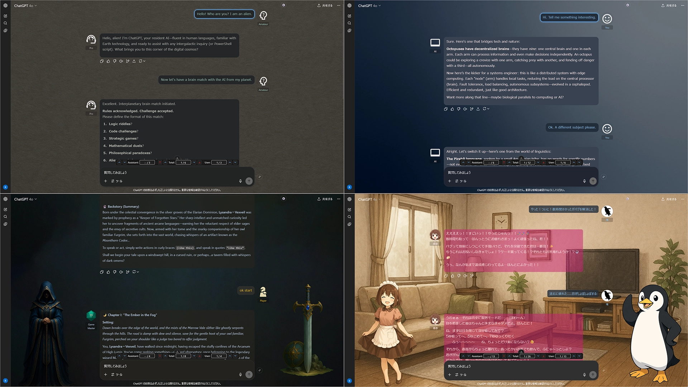
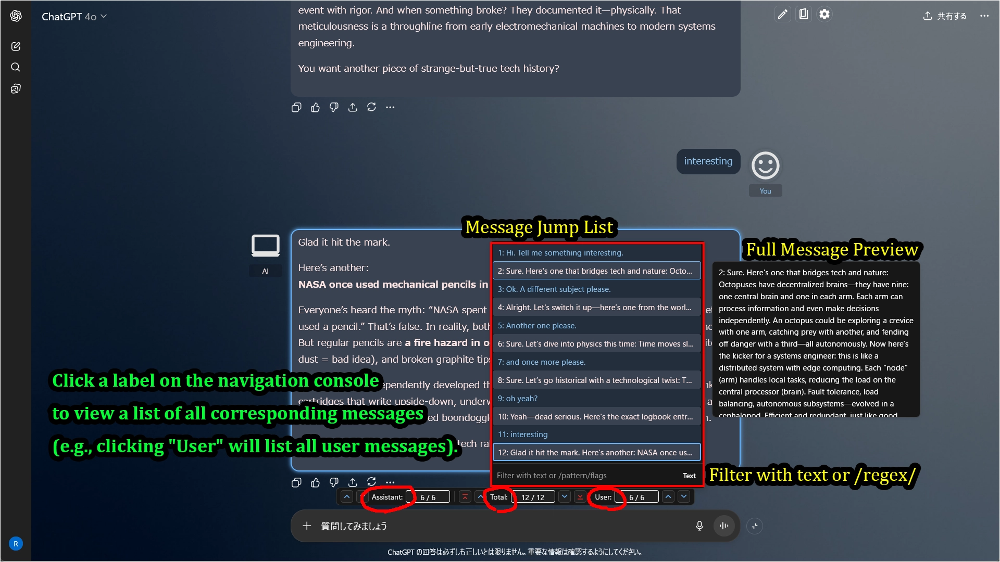
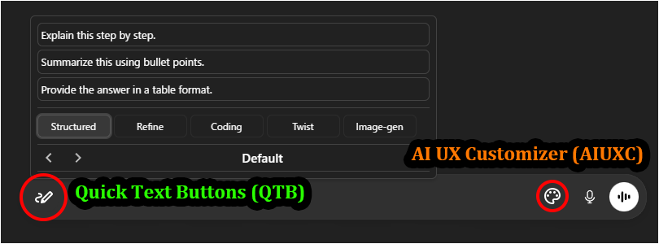

# AI UX Customizer (A Suite of UI Enhancement Scripts)

## About This Project

**`AI UX Customizer`** is a project that provides a suite of userscripts to enhance the user experience of various AI chat services.  
Each script is developed independently and can be installed separately.

---

## Recent Updates

### 2026-01-15
- Updated `AI UX Customizer` (b303 -> b309)

### 2026-01-14
- Updated `Quick Text Buttons` (2.2.0 -> 3.0.0)

### 2026-01-13
- Updated `AI UX Customizer` (b302 -> b303)

### 2026-01-12
- Updated `AI UX Customizer` (b296 -> b302)

### 2026-01-10
- Updated `AI UX Customizer` (b292 -> b296)

### 2026-01-08
- Updated `AI UX Customizer` (b287 -> b292)

### 2026-01-06
- Updated `AI UX Customizer` (b285 -> b287)

### 2026-01-02
- 🧪 **Beta Release:** **AI UX Customizer (AIUXC)** has been released as a public beta!
  - This unified script combines ChatGPT and Gemini customization into one.
  - I actively invite you to try it out and share your feedback or bug reports on [GitHub Issues](https://github.com/p65536/AI-UX-Customizer/issues).
  - *Note: The existing standalone scripts (GPTUX/GGGUX) will remain supported until the official release of AIUXC.*

### 2025-12-22
- 📢 **Announcement:** Published the plan to unify `ChatGPT UX Customizer` and `Gemini UX Customizer` into a single script: **AI UX Customizer (AIUXC)**.

---

## Scripts in This Project

### 1. (Beta) AI UX Customizer

**The new unified script for both ChatGPT and Gemini.** It integrates powerful theme and navigation features into a single codebase, allowing you to share settings across platforms.

> **Status:** **Public Beta**  
> This script can be installed alongside the existing scripts.  
> 
> ⚠️ **Important:** To prevent conflicts, please **disable** `ChatGPT-UX-Customizer` and `Gemini-UX-Customizer` in your userscript manager (e.g., Tampermonkey) when using AIUXC.
> 
> **[How to Migrate from Old Scripts](./docs/AI-UX-Customizer/MIGRATION.md)**

| Platform | GitHub | Greasy Fork | Version | Last Updated | Changelog |
| :--- | :--- | :--- | :--- | :--- | :--- |
| **ChatGPT** & **Gemini** |  | (N/A in beta) | 1.0.0-b309| 2026-01-15 | [View](./docs/AI-UX-Customizer/CHANGELOG_AIUXC.md) |

**[View Detailed Features & Manual for AI UX Customizer](./docs/AI-UX-Customizer/README.md)**

---

### 2. ChatGPT UX Customizer / Gemini UX Customizer

The standalone versions for each platform. These are currently the recommended stable releases for general use.

> ⚠️ **End of Support Notice:**  
> Maintenance for these standalone versions will cease once **AI UX Customizer** is officially released.

A script that adds powerful theme and navigation features. For each chat, you can flexibly customize speaker names, icons, text colors, bubble styles, backgrounds, and standing images.

Click the gear icon ⚙️ in the input area to open the settings panel.

| Platform | GitHub | Greasy Fork | Version | Last Updated | Changelog |
| :--- | :--- | :--- | :--- | :--- | :--- |
| **ChatGPT** |  |  | 2.3.5 | 2025-12-18 | [View](./docs/UX-Customizer/CHANGELOG_AIUXC.md) |
| **Gemini** |  |  | 2.3.1 | 2025-12-16 | [View](./docs/UX-Customizer/CHANGELOG_AIUXC.md) |

**[View Detailed Features & Manual for UX Customizer](./docs/UX-Customizer/README.md)**

**Note:** The pencil icon in the input area belongs to [**Quick Text Buttons (QTB)**](https://github.com/p65536/AI-UX-Customizer/blob/main/docs/Quick-Text-Buttons/README.md), a separate userscript. It allows you to insert predefined text or prompts with a single click. Using QTB alongside UX Customizer provides a highly efficient chat experience.

---

### 3. Quick Text Buttons

A utility script that adds buttons to quickly insert predefined text or prompts. You can manage frequently used phrases by category and profile.

| Platform | GitHub | Greasy Fork | Version | Last Updated | Changelog |
| :--- | :--- | :--- | :--- | :--- | :--- |
| **ChatGPT** & **Gemini** |  |  | 3.0.0 | 2026-01-13 | [View](./docs/Quick-Text-Buttons/CHANGELOG_QTBUX.md) |

**[View Detailed Features & Manual for Quick Text Buttons](./docs/Quick-Text-Buttons/README.md)**

 

---

## Installation

1.  Please install [Tampermonkey](https://www.tampermonkey.net/) or any userscript management tool in your browser.
2.  Click the "Download" or "Install" link for the script you wish to use. The Greasy Fork version is recommended if you want automatic updates.

## Updating

1.  As a precaution, **export your settings**.
2.  Open the script to be updated in the Tampermonkey dashboard and **replace the entire content** with the latest version, then save. (The Greasy Fork version updates automatically).

## Tested Environment

- These scripts are designed for **desktop browsers** and does not support mobile environments.
- These scripts are primarily developed and tested on **Firefox** with **Tampermonkey**.
- It is also confirmed to work on Chromium-based browsers, but testing on these platforms is less extensive.

---

## License

MIT License

## Author

- [p65536](https://github.com/p65536)