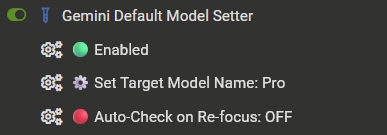
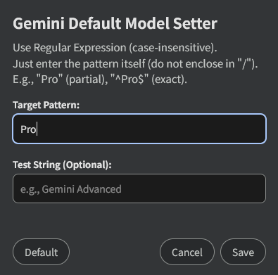

# AI UX Customizer (A Suite of UI Enhancement Scripts)

---

## Table of Contents

- [About This Project](#about-this-project)
- [Recent Updates](#recent-updates)
- **[Scripts in This Project](#scripts-in-this-project)**
  -  [1. AI UX Customizer (AIUXC)](#1-ai-ux-customizer-aiuxc)
  -  [2. Quick Text Buttons (QTB)](#2-quick-text-buttons-qtb)
  -  [3. Gemini Default Model Setter (GDMS)](#3-gemini-default-model-setter-gdms)
- [Installation](#installation)
- [Updating](#updating)
- [Tested Environment](#tested-environment)

---

## About This Project

**`AI UX Customizer`** is a project that provides a suite of userscripts to enhance the user experience of various AI chat services.
It integrates powerful theme and navigation features into a single codebase, allowing you to share settings across platforms.

---

## Temporary notice

> (2026-07-13)  
> Due to recent ChatGPT site changes, AI-UX-Customizer may not currently work properly.  
> Please consider temporarily disabling AI-UX-Customizer if you experience problems.  
> I plan to investigate and update the script, but the fix may take some time.  
> Thanks for your patience.  

---

## Recent Updates

### 2026-07-12
- Updated `AI UX Customizer` (1.4.11 -> 1.4.12)

### 2026-07-09
- Updated `Gemini Default Model Setter` (1.4.1 -> 1.5.0)

### 2026-06-30
- Updated `AI UX Customizer` (1.4.10 -> 1.4.11)
- Updated `Quick Text Buttons` (3.3.9 -> 3.3.10)
- Updated `Gemini Default Model Setter` (1.4.0 -> 1.4.1)

---

## Scripts in This Project

### 1. AI UX Customizer (AIUXC)

A userscript that adds powerful **theming**, **UI customization**, and **advanced navigation** features to AI chat UIs.

> [!IMPORTANT]
> **Migration Notice for Old Script Users**  
> If you are currently using the standalone `ChatGPT UX Customizer (GPTUX)` or `Gemini UX Customizer (GGGUX)`, you must disable or delete them to prevent conflicts. Your current settings can be safely transferred to this new unified version.
> 
> **[Please read the Migration Guide before installing](./docs/AI-UX-Customizer/MIGRATION.md)**

| Platform | GitHub | Greasy Fork | Version | Last Updated | Changelog |
| :--- | :--- | :--- | :--- | :--- | :--- |
| **ChatGPT** **Gemini** |  |  | 1.4.12 | 2026-07-12 | [View](./docs/AI-UX-Customizer/CHANGELOG_AIUXC.md) |

**[View Detailed Features & Manual for AI UX Customizer](./docs/AI-UX-Customizer/README.md)**

**Note:** The pencil icon in the input area belongs to [**Quick Text Buttons (QTB)**](https://github.com/p65536/AI-UX-Customizer/blob/main/docs/Quick-Text-Buttons/README.md), a separate userscript. It allows you to insert predefined text or prompts with a single click. Using QTB alongside AIUXC provides a highly efficient chat experience.

---

### 2. Quick Text Buttons (QTB)

Adds customizable text buttons to paste frequently used prompts into [ChatGPT/Gemini/Claude] inputs. Efficiently manage your snippets and templates by category and profile.

| Platform | GitHub | Greasy Fork | Version | Last Updated | Changelog |
| :--- | :--- | :--- | :--- | :--- | :--- |
| **ChatGPT** **Gemini** **Claude** |  |  | 3.3.10 | 2026-06-30 | [View](./docs/Quick-Text-Buttons/CHANGELOG_QTBUX.md) |

**[View Detailed Features & Manual for Quick Text Buttons](./docs/Quick-Text-Buttons/README.md)**

 

---

### 3. Gemini Default Model Setter (GDMS)

Automatically forces Google Gemini to use your preferred model (e.g., "Flash" or "Pro") and your preferred Extended Thinking state (ON/OFF) upon page load, URL change, or tab return. Sets the initial state but allows you to seamlessly switch models or toggle settings manually if needed mid-task.

| Platform | GitHub | Greasy Fork | Version | Last Updated | Changelog |
| :--- | :--- | :--- | :--- | :--- | :--- |
| **Gemini** |  |  | 1.5.0 | 2026-07-09 | [View](./docs/Gemini-Default-Model-Setter/CHANGELOG_GDMS.md) |

**[View Detailed Features & Manual for Gemini Default Model Setter](./docs/Gemini-Default-Model-Setter/README.md)**

  
  

---

## Installation

1.  Please install [Tampermonkey](https://www.tampermonkey.net/) or any userscript management tool in your browser.
2.  Click the "Download" or "Install" link for the script you wish to use. The Greasy Fork version is recommended if you want automatic updates.

## Updating

1.  As a precaution, **export your settings**.
2.  Open the script to be updated in the Tampermonkey dashboard and **replace the entire content** with the latest version, then save. (The Greasy Fork version updates automatically).

## Tested Environment

- These scripts are designed for **desktop browsers** and does not support mobile environments.
- These scripts are primarily developed and tested on **Firefox** with **Tampermonkey**.
- It is also confirmed to work on Chromium-based browsers, but testing on these platforms is less extensive.

---

## License

MIT License

## Author

- [p65536](https://github.com/p65536)