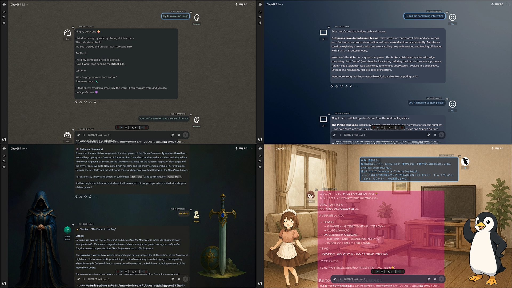
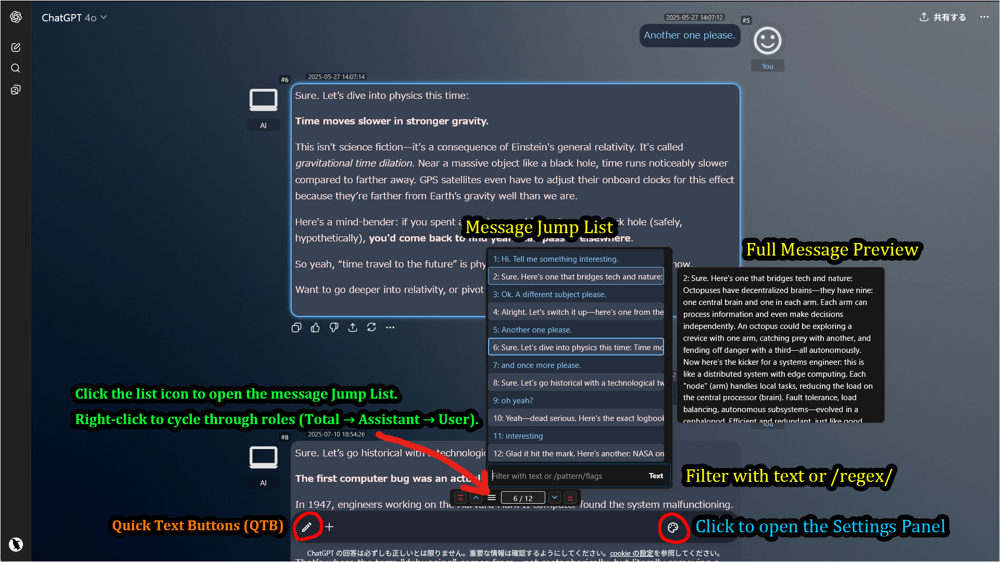
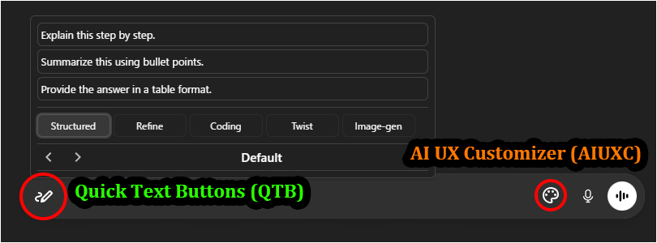

# AI UX Customizer (A Suite of UI Enhancement Scripts)

## About This Project

**`AI UX Customizer`** is a project that provides a suite of userscripts to enhance the user experience of various AI chat services.
It integrates powerful theme and navigation features into a single codebase, allowing you to share settings across platforms.

> [!NOTE]
> **Project Status Update (2026-03-21)**
> * **AI UX Customizer (AIUXC)** is now the **Official Stable Release**.
> * The legacy standalone scripts (`ChatGPT-UX-Customizer` & `Gemini-UX-Customizer`) are now **Deprecated**.
> * Please migrate to AIUXC for future updates. [**Read the Migration Guide**](./docs/AI-UX-Customizer/MIGRATION.md)

> [!NOTE]
> **Resolved: ChatGPT Navigation and Scrolling Stability**
> 
> **Issue (April 2026):**
> A previous site update to ChatGPT introduced "virtual scrolling" (dynamically unmounting off-screen messages), which temporarily caused incorrect message counts and erratic scrolling behavior.
> 
> **Current Status:**
> This has been resolved. I have implemented a fundamental **API-based tracking logic** (previously mentioned in future plans) to ensure reliable message management regardless of the DOM state. 
> 
> Furthermore, ChatGPT has since reverted the "virtual scrolling" behavior, and the site has returned to its previous specification. Combined with the new API-based architecture, message navigation and UI stability are now fully restored and significantly more robust than before.

---

## Recent Updates

### 2026-05-04
- Updated `AI UX Customizer` (1.1.1 -> 1.2.0)

### 2026-04-22
- Updated `AI UX Customizer` (1.1.0 -> 1.1.1)

### 2026-04-21
- Updated `AI UX Customizer` (1.0.5 -> 1.1.0)
- **Update on Known Issue**: Updated the README to announce the resolution of the ChatGPT navigation and scrolling issues via the v1.1.0 interim fix. *(Note: This issue was resolved in v1.2.0)*

---

## Scripts in This Project

### 1. AI UX Customizer (AIUXC)

A userscript that adds powerful **theming**, **UI customization**, and **advanced navigation** features to AI chat UIs.

> [!IMPORTANT]
> **Migration Notice for Old Script Users**  
> If you are currently using the standalone `ChatGPT UX Customizer (GPTUX)` or `Gemini UX Customizer (GGGUX)`, you must disable or delete them to prevent conflicts. Your current settings can be safely transferred to this new unified version.
> 
> **[Please read the Migration Guide before installing](./docs/AI-UX-Customizer/MIGRATION.md)**

| Platform | GitHub | Greasy Fork | Version | Last Updated | Changelog |
| :--- | :--- | :--- | :--- | :--- | :--- |
| **ChatGPT** & **Gemini** |  |  | 1.2.0 | 2026-05-04 | [View](./docs/AI-UX-Customizer/CHANGELOG_AIUXC.md) |

**[View Detailed Features & Manual for AI UX Customizer](./docs/AI-UX-Customizer/README.md)**

**Note:** The pencil icon in the input area belongs to [**Quick Text Buttons (QTB)**](https://github.com/p65536/AI-UX-Customizer/blob/main/docs/Quick-Text-Buttons/README.md), a separate userscript. It allows you to insert predefined text or prompts with a single click. Using QTB alongside AIUXC provides a highly efficient chat experience.

---

### 2. Quick Text Buttons (QTB)

Adds customizable text buttons to paste frequently used prompts into ChatGPT/Gemini inputs. Efficiently manage your snippets and templates by category and profile.

| Platform | GitHub | Greasy Fork | Version | Last Updated | Changelog |
| :--- | :--- | :--- | :--- | :--- | :--- |
| **ChatGPT** & **Gemini** |  |  | 3.1.5 | 2026-03-20 | [View](./docs/Quick-Text-Buttons/CHANGELOG_QTBUX.md) |

**[View Detailed Features & Manual for Quick Text Buttons](./docs/Quick-Text-Buttons/README.md)**

 

---

## Installation

1.  Please install [Tampermonkey](https://www.tampermonkey.net/) or any userscript management tool in your browser.
2.  Click the "Download" or "Install" link for the script you wish to use. The Greasy Fork version is recommended if you want automatic updates.

## Updating

1.  As a precaution, **export your settings**.
2.  Open the script to be updated in the Tampermonkey dashboard and **replace the entire content** with the latest version, then save. (The Greasy Fork version updates automatically).

## Tested Environment

- These scripts are designed for **desktop browsers** and does not support mobile environments.
- These scripts are primarily developed and tested on **Firefox** with **Tampermonkey**.
- It is also confirmed to work on Chromium-based browsers, but testing on these platforms is less extensive.

---

## License

MIT License

## Author

- [p65536](https://github.com/p65536)