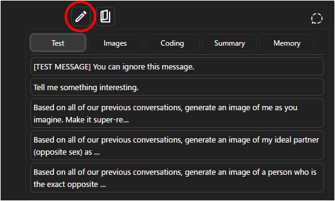

# AI UX Customizer (AIサービスのUI改善)

[English README is here.](./README.md)

## 本プロジェクトについて

**`AI UX Customizer`** は、様々なAIチャットサービスのユーザー体験を向上させるためのユーザースクリプト群を提供するプロジェクトです。  
各スクリプトは独立しており、個別にインストールして利用できます。

---

## 最近の更新

### 2025/09/05
- `ChatGPT UX Customizer`/`Gemini UX Customizer`を更新（v1.3.7 -> v1.4.0）
- `Quick Text Buttons`を更新 (v1.1.0 -> v1.1.1)

### 2025/08/31
- `Quick Text Buttons`を更新 (v1.0.1 -> v1.1.0)
- `ChatGPT UX Customizer`/`Gemini UX Customizer`を更新（v1.3.6 -> v1.3.7）

### 2025/08/26
- `ChatGPT UX Customizer`/`Gemini UX Customizer`を更新（v1.3.3 -> v1.3.6）

### 2025/08/22
- `ChatGPT UX Customizer`/`Gemini UX Customizer`を更新（v1.3.2 -> v1.3.3）

---

## スクリプト一覧

### 1. ChatGPT UX Customizer / Gemini UX Customizer

強力なテーマ機能とナビゲーション機能を追加するスクリプトです。チャットごとに、話者名、アイコン、文字色、吹き出し、背景、立ち絵などを柔軟にカスタマイズできます。

| 対象 | GitHub | Greasy Fork | バージョン | 最終更新日 | 変更履歴 |
| :--- | :--- | :--- | :--- | :--- | :--- |
| **ChatGPT** |  |  | 1.4.0 | 2025/09/05 | [参照](./docs/UX-Customizer/CHANGELOG_AIUXC_ja.md) |
| **Gemini** |  |  | 1.4.0 | 2025/09/05 | [参照](./docs/UX-Customizer/CHANGELOG_AIUXC_ja.md) |

**[UX Customizer の詳細はこちら](./docs/UX-Customizer/README_ja.md)**

---

### 2. Quick Text Buttons

定型文やプロンプトを素早く入力するためのボタンを追加するユーティリティスクリプトです。よく使う文章をカテゴリやプロファイルごとに管理できます。

| 対象 | GitHub | Greasy Fork | バージョン | 最終更新日 | 変更履歴 |
| :--- | :--- | :--- | :--- | :--- | :--- |
| **ChatGPT** & **Gemini** |  |  | 1.1.1 | 2025/09/05 | [参照](./docs/Quick-Text-Buttons/CHANGELOG_QTBUX_ja.md) |

**[Quick Text Buttons の詳細はこちら](./docs/Quick-Text-Buttons/README_ja.md)**

 

---

## インストール

1.  [Tampermonkey](https://www.tampermonkey.net/) または任意のユーザースクリプト管理ツールをブラウザに導入してください。
2.  利用したいスクリプトの「ダウンロード」または「インストール」リンクをクリックしてください。スクリプトを自動更新したい方はGreasy Fork版をおすすめします。

## アップデート

1.  念のため**設定をエクスポート**しておく
2.  Tampermonkeyのダッシュボードで更新対象のスクリプトを開き、最新版に**全文置換**して保存（Greasy Fork版は自動更新されます）

## ライセンス

MIT License

## 作者

* [p65536](https://github.com/p65536)
