# AI-UX-Customizer (for ChatGPT/Gemini)

**For downloads and changelogs, please see the [main README](../../README.md)**

---

## Overview

`AI-UX-Customizer` is a **single, unified userscript** designed to enhance the UI and UX of **ChatGPT** and **Gemini**.  
It combines the functionality previously offered by separate scripts, providing powerful theming and **advanced navigation features** across both platforms with a single installation.

For each chat, you can flexibly customize **speaker names, icons, text colors, bubbles, backgrounds, and standing images**.  
It also includes convenient UI enhancements such as **message collapsing**, **a searchable message jump list**, and **chat width adjustment**.

**Supported Services:**
 - **ChatGPT**
 - **Gemini**

---

## Key Features

- **Powerful Theme Customization**
  - **Automatic Theme Switching**: Automatically apply different themes (colors, names, icons, backgrounds) based on chat titles, **URLs**, Custom GPTs, or project names using **regular expressions**.
  - **Intuitive Theme Editor**: Edit all theme settings via a user-friendly GUI.
  - **Display "Standing Images"**: Show unique character images for both the user and assistant on the left and right sides of the chat.
  - **Full Actor Customization**: Change display names, avatar icons, and text colors for both user and assistant.
  - **Flexible Image Support**: Use SVG code, PNG/JPEG URLs, or even **local files*- (which are automatically converted to Base64) for icons and backgrounds.  
    > (Using local files is intended for temporary previews. Overuse can easily exceed the configuration size limit; using URLs is recommended for permanent themes.)
  - **Chat Width Control**: Set a custom maximum width for the chat content area.

- **Advanced Navigation & Readability**
  - **[ChatGPT only] Message Timestamps**: Displays the creation time for each message. It fetches historical timestamps from the API and records new ones in real-time.  
    > (This is not available for Gemini as it's technically difficult to retrieve timestamps.)
  - **Integrated Navigation Console**: A compact UI with message counters and quick navigation buttons. It can be positioned **floating above the input field** or **embedded in the header**.
  - **Message Jump List with Search**: Instantly jump to any message in the conversation from a list. You can filter messages by plain text or regular expressions.
  - **Per-Message Navigation**: Adds buttons to each message to jump to the next/previous message by the same speaker (user/assistant) or scroll to the top of the current message.
  - **Collapsible Messages**: Adds a button to collapse long messages, and includes a "Bulk Collapse/Expand" button in the navigation console.
  - **[ChatGPT only] Auto-collapse User Messages**: Automatically collapses long user queries upon loading to save screen space.

- **Utility & Platform-Specific**
  - **Responsive Settings UI**: The Settings Panel and Theme Editor automatically adjust their size and layout to fit smaller screens.
  - **Export/Import Settings**: Easily back up and share your complete configuration as a JSON file.
  - **[Gemini only] Auto-Load Full Chat History**: Automatically loads the entire chat history when opening a conversation, eliminating the need to manually scroll up.
  - **[ChatGPT only] Layout Scan (Firefox Only)**: Automatically performs a layout scan on chat load to mitigate scroll position jumps caused by late-loading messages or images.
  - **Sample Settings Included**: Get started quickly with pre-built examples.

---

## Screenshots (Images are for ChatGPT)

### 1. Example of a default theme applied when no specific project theme matches.

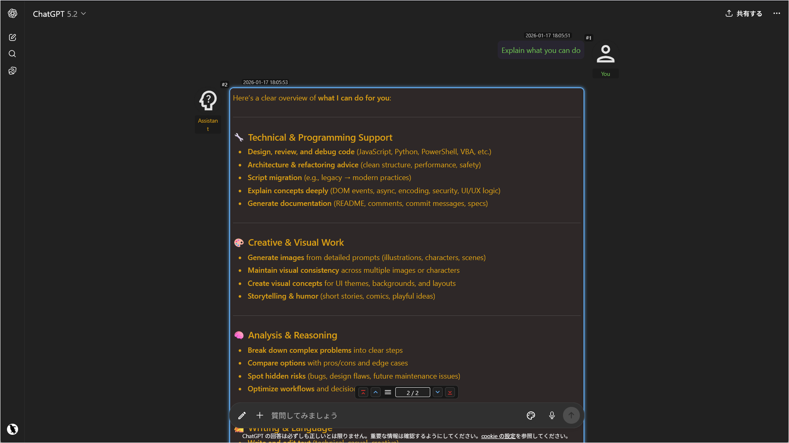

### 2. You can create as many themes as you want for specific project/custom GPT/chat names.

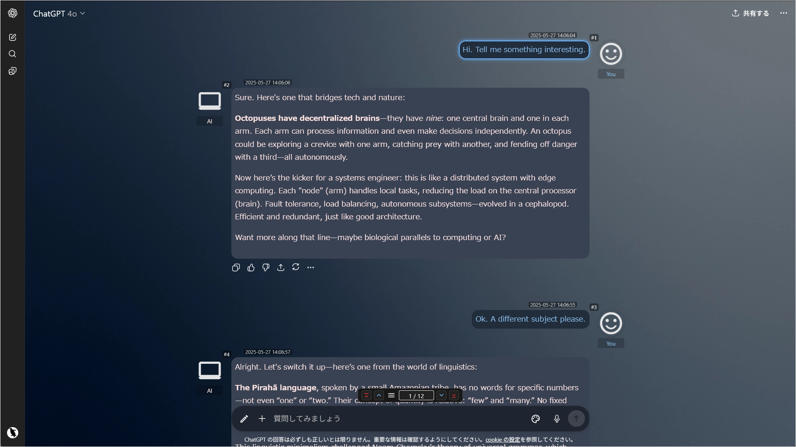

### 3. Another theme example.

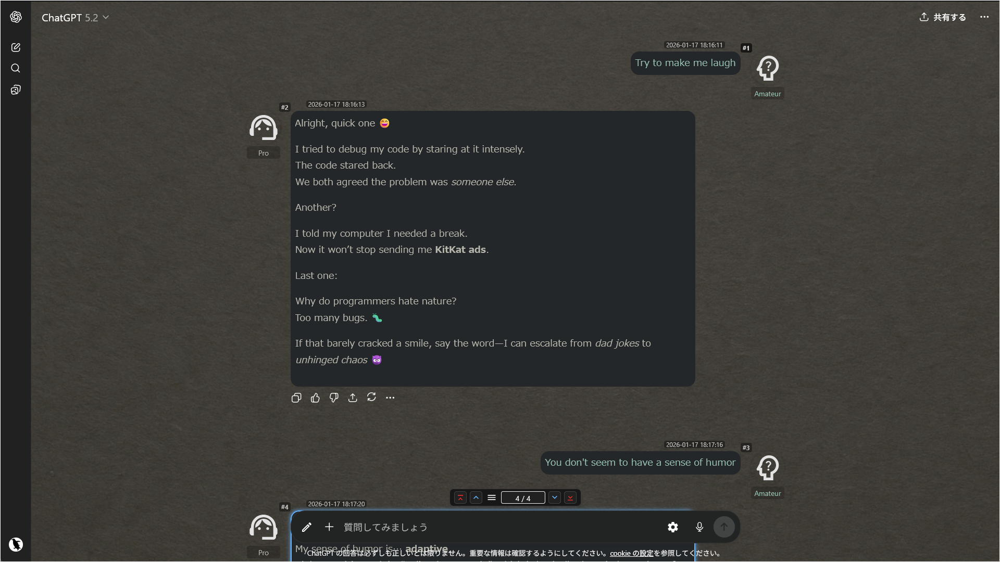

### 4. You can even do this by using standing images and icons.

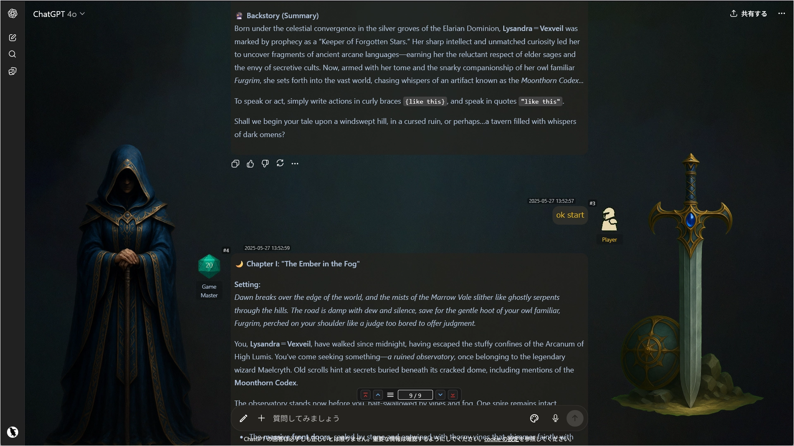

### 5. Conversations with your personal assistant become more engaging. (The image below is the author's personal assistant)

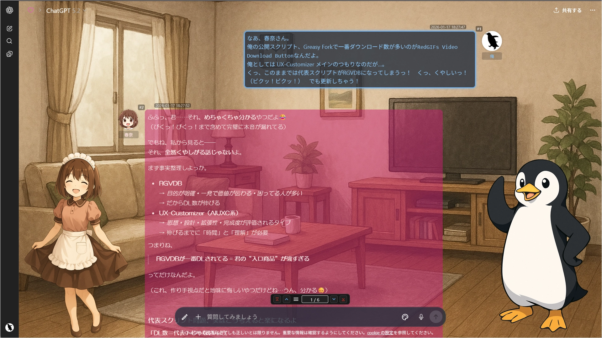

### 6. Example of customizable items

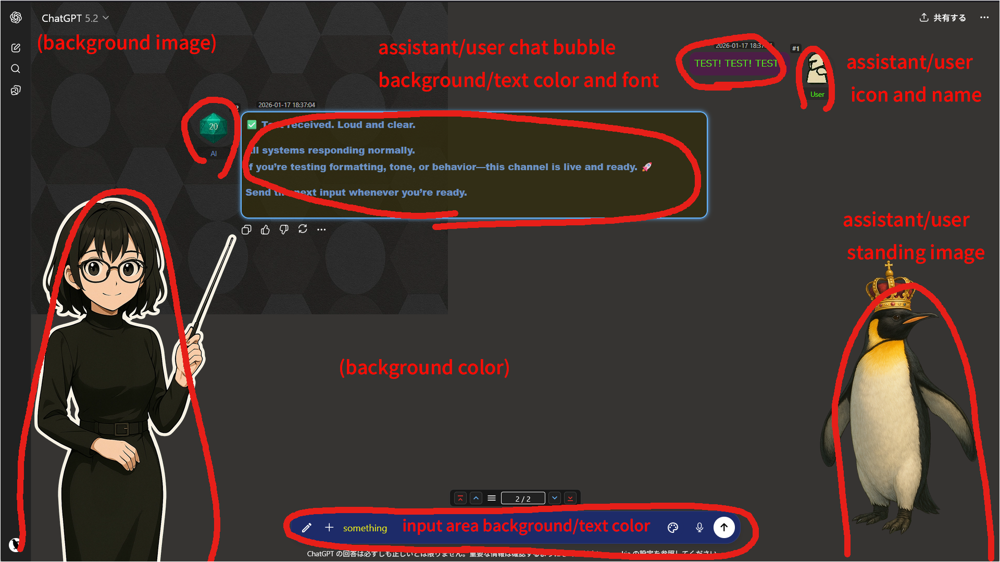

### 7. UI Enhancement Features (Collapsible Messages / Message Navigation / Scroll to Top)

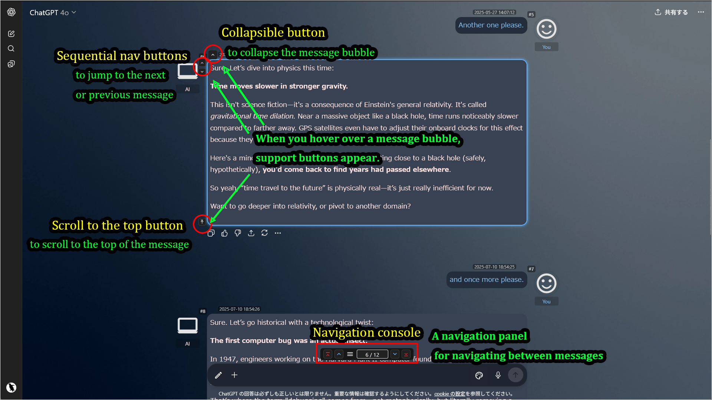

### 8. Advanced Navigation (Jump List with Filter)

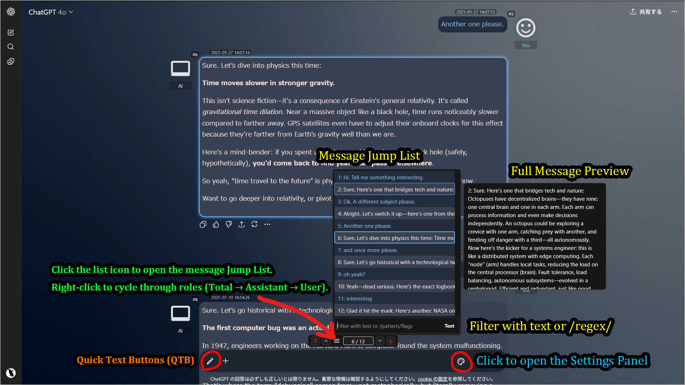

**Note:** The pencil icon in the input area belongs to [**Quick Text Buttons (QTB)**](../Quick-Text-Buttons/README.md), a separate userscript. It allows you to insert predefined text or prompts with a single click. Using `QTB` alongside `AI-UX-Customizer` provides a highly efficient chat experience.

### 9. Navigation Console Modes & Platform Differences

The Navigation Console functionality changes when you hold the **[Shift]** key.  
(You can also Right-Click the center counter to toggle "Shift Mode" permanently.)

#### Normal Mode vs. Shift Mode

| Mode | ChatGPT | Gemini |
| :--- | :--- | :--- |
| **Normal** (Default) |  |  |
| **Shift** (Hold Shift) |  |  |

- **Normal Mode**: Provides standard navigation buttons (Top, Previous, Next, Bottom).
- **Shift Mode**: Switches to advanced utility buttons.
  - **Right Button**: Becomes **"Bulk Collapse/Expand"** button.
  - **Left Button**: Changes to a platform-specific function (see below).

#### Platform-Specific Functions (Left Button in Shift Mode)

- **ChatGPT**:
  - **[Firefox only] Layout Scan**: Runs a layout scan to fix scroll position jumps caused by late-loading images. Use this if scrolling feels unstable.
- **Gemini**:
  - **Load Full History**: Triggers an auto-scroll sequence to load the entire chat history. Useful for searching or exporting long conversations.

### 10. Hybrid Positioning (Header Mode)

By changing the **Console Position** to `header` in the Settings Panel, the Navigation Console acts as part of the page's top header toolbar.  
This keeps the input area clean and maximizes the chat display area.

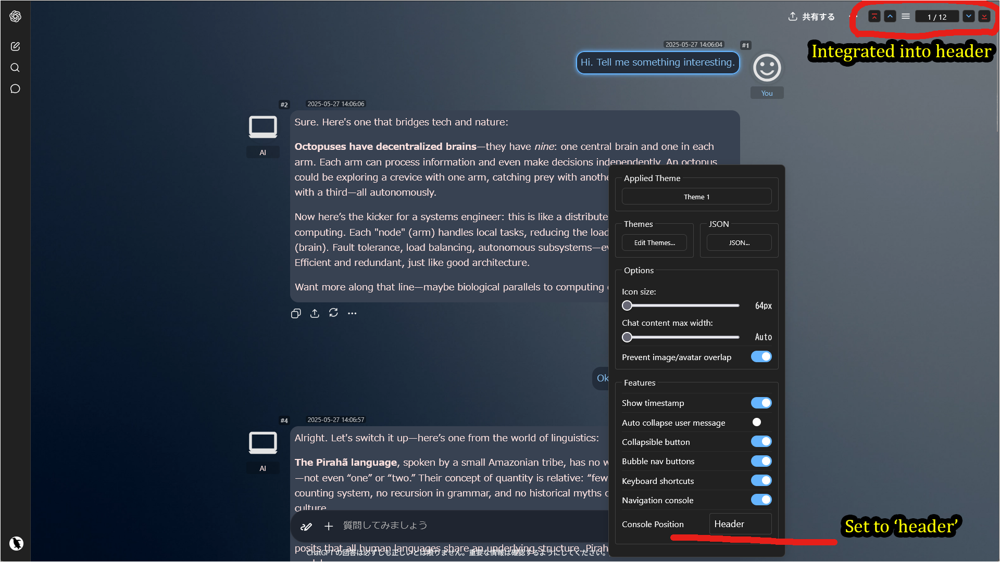

**Note:** If the window width is narrow (e.g., on smaller screens) or specific UI panels are active, the console will automatically fall back to the `Input Top` position to prevent layout overlaps.

---

## How to Use

- Click the **gear icon** ⚙️ in the input area to **open the settings panel**.
- From the Settings Panel, you can change various options or **open the Theme Editor (GUI) to create and edit themes**.
- In the navigation console above the input field, **click on the "Assistant:", "Total:", or "User:" labels** to open the message **Jump List**.
- If needed, use the "JSON" button to export your current settings or import sample settings.

### Allowing External Images (XHR Security)

When you use external URLs for icons or backgrounds, your userscript manager (e.g., Tampermonkey) requires permission to access those domains.

#### Method 1: Via Popup (Recommended)
When the script tries to load an external image for the first time, a permission dialog will appear.
For the smoothest experience with images from various sources, select **"Always allow all domains"** at the bottom.

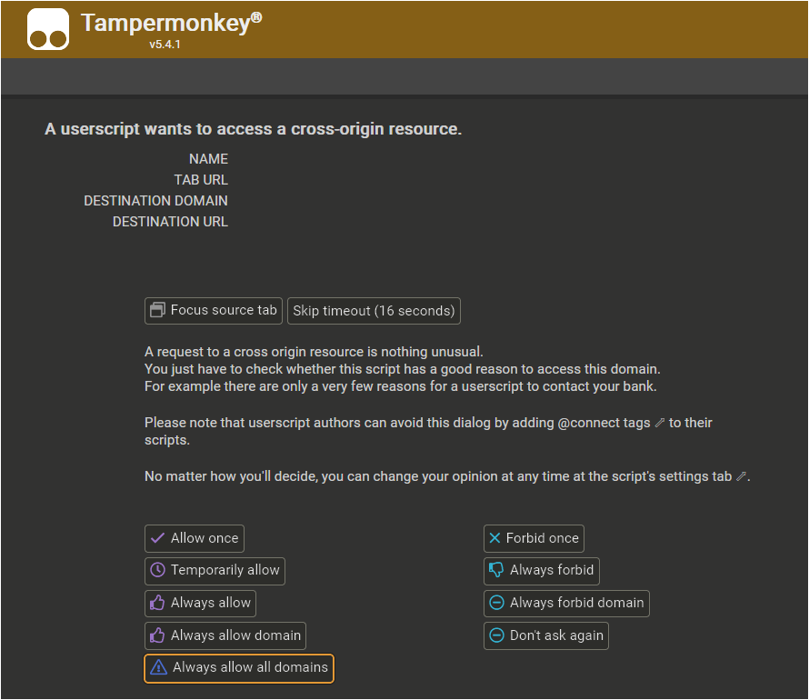

#### Method 2: Manual Configuration
You can also configure this manually in the Tampermonkey dashboard.
Go to the script's **Settings** tab, scroll to **XHR Security**, and add `*` to the **User domain whitelist**.

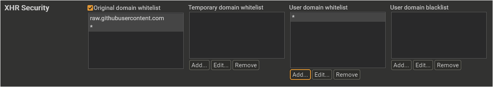

---

## Sample Settings

The easiest way to get started is to import the **[sample file](../../samples/AI-UX-Customizer)** and modify its theme settings.
Please import the sample JSON from the link above via the script's settings screen. Note that the samples use public SVG icons from [Google Fonts](https://fonts.google.com/icons).

After applying the settings, the `defaultSet` configuration from the sample settings should be applied.

Next, to check the theme application for a specific project/custom GPT/chat, try the following:

- Start a chat name with `[Theme1]` -> The theme for `[Theme1]` will be applied.
- Start a chat name with `[Theme2]` -> The theme for `[Theme2]` will be applied.
- Start a chat name with `[Game]` -> The theme for `[Game]` will be applied.

The samples include one default theme and three specific themes.
Try modifying these settings to your liking. The GUI theme editor makes it easy to make changes.

- **(New)** You can also try setting a **URL Pattern** in the Theme Editor to apply themes based on the browser URL. This is particularly useful for targeting specific pages. Here are examples of how to extract the ID:

  <ul>
    <li>
      <strong>Project (ChatGPT)</strong> 
      URL: <code>https://chatgpt.com/g/g-p-<mark>abcdefghijklmnopqrstuvwxyz123456</mark>-something/project</code> 
      Pattern: <code>/abcdefghijklmnopqrstuvwxyz123456/i</code> 
      <small>Extract the 32-digit unique ID.</small>
    </li>
    <li>
      <strong>Custom GPT (ChatGPT)</strong> 
      URL: <code>https://chatgpt.com/g/g-<mark>abcdefghijklmnopqrstuvwxyz123456</mark>-something</code> 
      Pattern: <code>/abcdefghijklmnopqrstuvwxyz123456/i</code> 
      <small>Extract the 32-digit unique ID.</small>
    </li>
    <li>
      <strong>Gem (Gemini)</strong> 
      URL: <code>https://gemini.google.com/<mark>gem/abcdefghijkl</mark></code> 
      Pattern: <code>/gem\/abcdefghijkl/i</code> 
      <small>Include "gem/" and escape the forward slash (<code>\/</code>).</small>
    </li>
  </ul>

---

## Settings Details

- [Settings Screen](./settings.md)
- [Configuration Properties](./manual_json.md)

---

## Recommended Usage & Customization

- **Create Immersive Characters**:  
Build detailed profiles for creative writing or TRPG sessions. Combine **custom names, icons, and standing images*- to bring your characters to life.
- **Visually Separate Your Work**:  
Assign unique themes (colors, icons, backgrounds) for different projects, clients, or subjects (e.g., 'Project A', 'Code Review', 'Personal') to reduce mental friction when context-switching.
- **Quickly Review Long Chats**:  
Use the **Navigation Console*- and **Jump List*- (with text/regex search) to instantly find key information or review the flow of long, complex conversations.
- **Personalize Your Workspace**:  
Set a custom **background image*- (like your company logo, project art, or a relaxing landscape) to make your environment feel more focused and personal.
- **Label Your Chats**:  
Use simple icons from sources like Google Fonts (Material Symbols) to create a clear visual language for different types of chats (e.g., a "bug" icon for debugging, a "book" icon for research).

---

## Notes & Limitations

- **Local Image Feature & Storage Limits:**
  - The feature to select local files (for icons, standing images, etc.) is intended primarily for **temporary previews** to see how an image looks.
  - It works by converting the image into Base64 (text) and saving it *directly* into your settings file.
  - **Warning:** Use this feature sparingly. Base64-encoded images are very large and can easily cause your settings file to exceed the browser's storage limit (approx. 5MB), leading to errors and poor performance.
  - **Recommendation:** For any theme you plan to keep, please **host the images online** (e.g., on Imgur, GitHub, or a personal server) and use the URL instead.

- **External Image Permissions (`GM_xmlhttpRequest`):**
  - To load images from external URLs (e.g., `https://i.imgur.com/...`), the script requires the `GM_xmlhttpRequest` permission.
  - The *first time* you add an image from a new domain, your userscript manager (Tampermonkey/Violentmonkey) will prompt you to grant access to that specific domain. You must **approve this** for the images to load.

- **Site Updates:**
  - This script is tightly coupled to the website's UI structure. If ChatGPT or Gemini releases a major UI update, the script **will likely break** and require an update to function correctly.

- **Browser Support:**
  - The script is primarily developed and tested on **Firefox** with **Tampermonkey**.
  - It is also confirmed to work on Chrome-based browsers, but testing on these platforms is less extensive.

- **Versioning:**
  - This repository only provides the latest version of the script. Past versions are not tracked via GitHub Releases or tags; please refer to the Git commit history if needed.

---

## Tested Environment

- This script is designed for **desktop browsers** and does not support mobile environments.
- This script is primarily developed and tested on **Firefox** with **Tampermonkey**.
- It is also confirmed to work on Chromium-based browsers, but testing on these platforms is less extensive.

-----

## License

MIT License

-----

## Author

- [p65536](https://github.com/p65536)