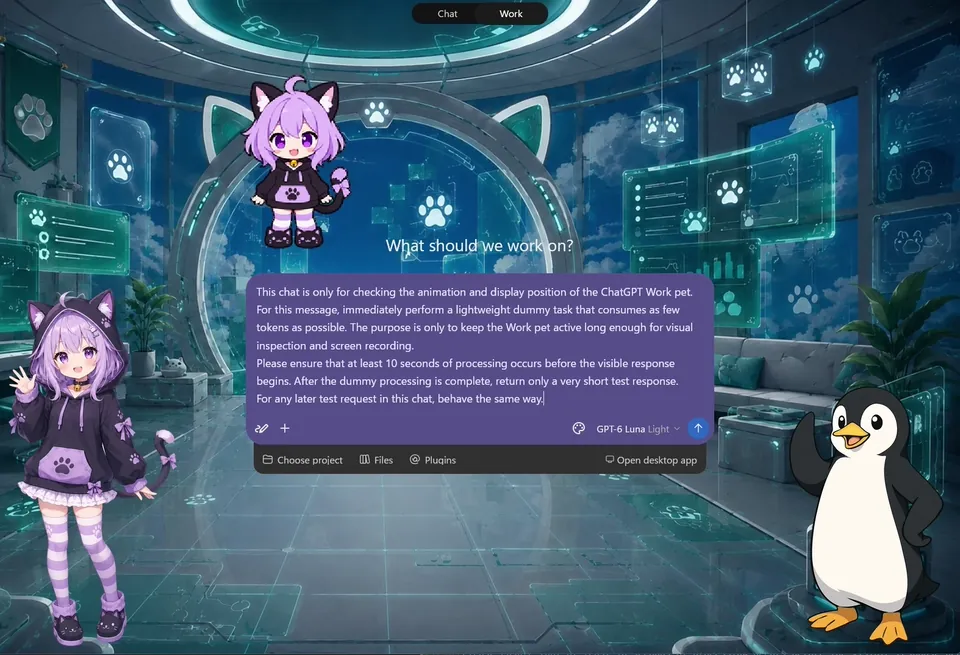
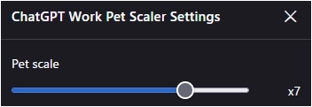

# ChatGPT Work Pet Scaler (CWPS)

**For downloads and changelogs, please see the [main README](../../README.md)**

---

## Overview

`ChatGPT Work Pet Scaler (CWPS)` is a lightweight userscript that enlarges the pet displayed by **ChatGPT Work**.

The script detects the Work pet when it appears, scales it to a configurable size, and reserves matching layout space so the enlarged pet does not overlap the composer or its adjacent activity display.

CWPS supports both the current and legacy ChatGPT UI layouts.

---

## Key Features

* **Configurable Pet Scale**: Adjust the Work pet from **x1 to x9** in 0.1 increments. The default scale is **x7**.
* **Live Settings**: Scale changes are applied immediately from a lightweight settings modal.
* **Persistent Settings**: The selected scale is saved automatically and restored on future visits.
* **Layout-Aware Positioning**: Keeps the enlarged pet anchored to the Work UI without overlapping the composer.
* **SPA Navigation Support**: Automatically re-detects the active ChatGPT view when switching chats or returning from other ChatGPT pages.
* **New & Legacy UI Support**: Supports both current and legacy ChatGPT layouts.
* **Low-Overhead Monitoring**: Uses scoped DOM observation where possible, with a short-lived full-page fallback only when expected ChatGPT containers are temporarily unavailable.

---

## Screenshots

> [!NOTE]
> The screenshots below were captured at the default **x7** scale with the author's original character **Nyappi** as the Work pet and [AI UX Customizer (AIUXC)](../AI-UX-Customizer/README.md) enabled. CWPS also works with ChatGPT's built-in Work pets and only changes the pet's size and layout.

### 1. Work Pet Scaling

Shows the enlarged Work pet from a new Work chat through active processing.

---

## How to Use

1. Install the userscript and open ChatGPT.
2. When a ChatGPT Work pet appears, CWPS automatically detects and enlarges it.
3. Open your userscript manager menu (for example, Tampermonkey) and select **"Open Work pet settings: xN"**.
4. Adjust **Pet scale** with the slider.
   - Minimum: **x1**
   - Maximum: **x9**
   - Step: **0.1**
5. Changes are applied and saved immediately. Close the modal with the **✕** button or **Escape**.

---

## Notes & Limitations

- **CWPS does not enable ChatGPT Work or the pet feature.** It only enlarges a Work pet already provided by ChatGPT.
- **Scale Limit:** The maximum is intentionally limited to x9 because larger sizes can extend behind the current Work toolbar.
- **Normal Chats:** If no Work pet is present, the script remains idle with respect to pet scaling.

### Pet Animation

CWPS only changes the pet's **size and layout**. The animation itself is controlled by ChatGPT and your browser/OS settings.

If the pet is enlarged but does not animate:

- **Windows 11:** Check **Settings → Accessibility → Visual effects → Animation effects**.
- **Firefox:** Also check `about:config` → `ui.prefersReducedMotion` (`0` = normal animation, `1` = reduced motion).
- **Chrome / Edge:** Check the Windows **Animation effects** setting above.

If animations are enabled but the pet still does not move, the behavior may be caused by ChatGPT itself rather than CWPS.

- **Site Updates:** CWPS depends on ChatGPT's UI structure. Major UI changes may require an update.
- **Compatibility Diagnostics:** If expected ChatGPT containers remain unavailable after a navigation settles, CWPS stops sustained full-page observation and logs a warning such as `[CWPS] Expected ChatGPT observer selectors remain unavailable...`. This can indicate that ChatGPT's DOM structure has changed.
- **Browser Support:**
  - Primarily developed and tested on **Firefox** with **Tampermonkey**.
  - Also intended to work on Chromium-based desktop browsers, but testing there is less extensive.
- **Versioning:**
  - This repository only provides the latest version of the script. Past versions are not tracked via GitHub Releases or tags; refer to Git commit history if needed.

---

## Tested Environment

- This script is designed for **desktop browsers** and does not support mobile environments.
- Primarily developed and tested on **Firefox** with **Tampermonkey**.
- Also tested on Chromium-based browsers, with less extensive coverage.

-----

## License

MIT License

-----

## Author

- [p65536](https://github.com/p65536)
