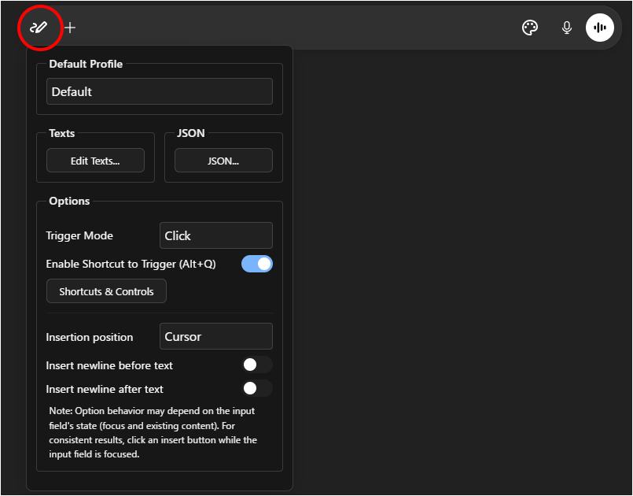
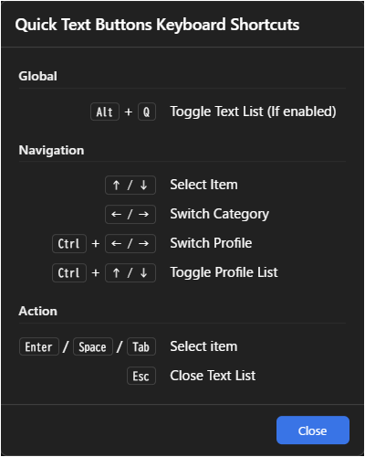

# Quick-Text-Buttons

**For downloads and changelogs, please see the [main README](../../README.md)**

---

## Overview

`Quick-Text-Buttons` is a utility script that adds customizable buttons to quickly insert predefined text into the input fields of AI services like ChatGPT and Gemini.
You can efficiently manage and utilize frequently used instructions and prompts by organizing them into "profiles" and "categories."

Currently, it supports the following AI services:

 - **ChatGPT**
 - **Gemini**

---

## Key Features

* **Streamlined UI integrated into the input area**
* **Enhanced Text Editor with Drag & Drop reordering**
* **Keyboard shortcuts (Alt+Q) and full keyboard navigation support**
* Real-time settings synchronization across multiple tabs
* Manage registered text by classifying it into "profiles" and "categories"
* Switch between profiles (sets of categories) to use text sets tailored for different purposes
* Specify the insertion position of the text (cursor position / start / end)
* Option to automatically insert a newline before or after the text
* Settings export/import functionality (in JSON format)
* **Includes sample settings, making it easy to get started.**

---

## Screenshots

### 1. Text List

When you **Hover** (or **Click**, depending on settings) over the button:  

* **Perfect Match:** Works seamlessly with [**AI UX Customizer**](../AI-UX-Customizer/README.md) to enhance the visual interface and navigation.

### 2. Settings Panel

When you Right-click the button:  

### 3. Text Editor Modal

### 4. Keyboard Shortcuts

---

## How to Use

### 1. Access & Navigation
The **Quick Text button** (pen icon) is located at the bottom-left of the chat input field.  
**Hover** (or **Click**, depending on settings) over the button to open the list.

* **Text**: Click an item to insert it directly into the input field.
* **Category**: Switch tabs to view different groups of texts.
* **Profile**: Switch profiles to load a completely different set of texts.

**Keyboard Shortcuts:**
* **Alt + Q**: Quickly toggle the text list.
* **Arrow keys**: Navigate through the list.
* **Enter/Space/Tab**: Insert the selected text.
* **Ctrl + Arrow keys**: Switch profiles.

### 2. Settings & Customization
* **Settings**: **Right-click** the button to open the **Settings Panel**, where you can edit texts, manage profiles, and change options.
* **Import/Export**: If needed, use the "JSON" button in the settings panel to export your current settings or import sample settings.

---

## Sample Settings

The easiest way to get started is to download a sample file from the [samples folder](../../samples/Quick-Text-Buttons) and modify its contents to your liking.  
Please import the sample JSON via the script's settings screen (JSON modal).

---

## Settings Details

- [Settings Screen](./settings.md)
- [Configuration Properties](./manual_json.md)

---

## License

MIT License

-----

## Author

  * [p65536](https://github.com/p65536)