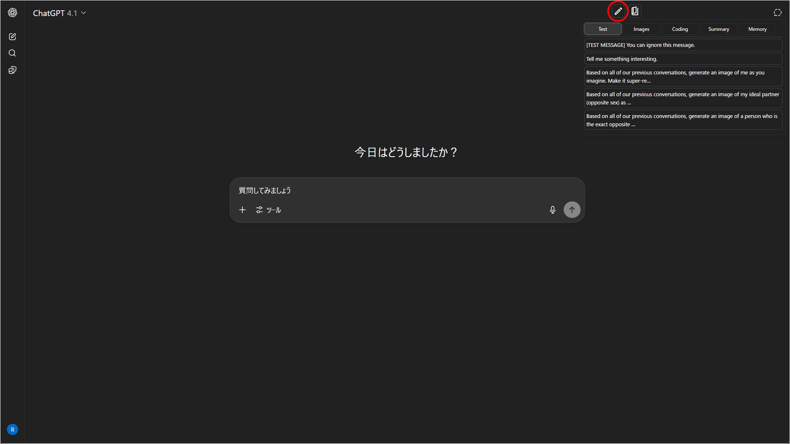

# Quick-Text-Buttons

[日本語のREADMEはこちら。](./README_ja.md)

**For downloads and changelogs, please see the [main README](../../README.md)**

---

## Overview

`Quick-Text-Buttons` is a utility script that adds customizable buttons to quickly insert predefined text into the input fields of AI services like ChatGPT and Gemini.
You can efficiently manage and utilize frequently used instructions and prompts by organizing them into "profiles" and "categories."

Currently, it supports the following AI services:

 - **ChatGPT**
 - **Gemini**

---

## Key Features

* **Intuitive text editing via GUI**
* Manage registered text by classifying it into "profiles" and "categories"
* Switch between profiles (sets of categories) to use text sets tailored for different purposes
* Specify the insertion position of the text (cursor position / start / end)
* Option to automatically insert a newline before or after the text
* Settings export/import functionality (in JSON format)
* **Includes sample settings, making it easy to get started.**

---

## Screenshots

### 1. Insert Text Button and Pop-up Menu

### 2. Settings Panel

### 3. Text Editor Modal

---

## How to Use

* Hovering over the `Insert Text button` (pen icon) in the upper right corner will display the list of registered texts. Clicking one will insert the text into the input field.
* Open the settings panel from the `Settings button` (book icon) in the upper right corner to edit texts and change options.
* If needed, use the "JSON" button to export your current settings or import sample settings.

---

## Sample Settings

The easiest way to get started is to import the [sample file](https://raw.githubusercontent.com/p65536/AI-UX-Customizer/main/samples/Quick-Text-Buttons/text_presets.json) and modify its contents to your liking.  
Please import the sample JSON from the link above via the script's settings screen (JSON modal).

---

## Settings Details

- [Settings Screen](./settings.md)
- [Configuration Properties](./manual_json.md)

---

## License

MIT License

-----

## Author

  * [p65536](https://github.com/p65536)