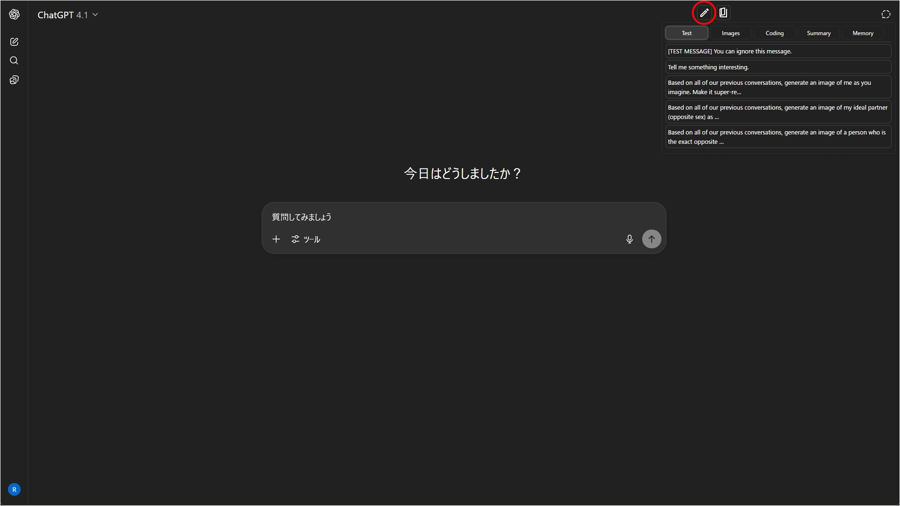

# Quick-Text-Buttons

[English README is here.](./README.md)

**ダウンロードや更新履歴は[トップページ](../../README_ja.md)から**

---

## 概要

`Quick-Text-Buttons`は、ChatGPTやGeminiの入力欄に、定型文を素早く挿入するためのカスタマイズ可能なボタンを追加するユーティリティスクリプトです。  
よく使う指示やプロンプトを「プロファイル」や「カテゴリ」で分類し、効率的に管理・利用することができます。

現在は以下のAIサービスに対応しています。

 - **ChatGPT**
 - **Gemini**

---

## 主な機能

* **GUIによる直感的なテキスト編集機能**
* 登録したテキストを「プロファイル」と「カテゴリ」で分類・管理可能
* プロファイル（カテゴリのセット）を切り替えて、用途に応じたテキストセットを利用可能
* テキストの挿入位置（カーソル位置／先頭／末尾）を指定可能
* テキストの前後に改行を自動で挿入するオプション
* 設定のエクスポート／インポート機能（JSON形式）
* **設定サンプルあり。すぐに使い始めることができます**

---

## 実行イメージ

### 1. テキスト挿入ボタンとポップアップメニュー

### 2. 設定パネル

### 3. テキスト編集モーダル

---

## 使い方

* 画面右上の`テキスト挿入ボタン`（ペンのアイコン）にホバーすると、登録したテキストのリストが表示されます。クリックするとテキストが入力欄に挿入されます。
* 画面右上の`設定ボタン`（本のアイコン）から設定パネルを開き、テキストの編集やオプションの変更ができます。
* 必要に応じて"JSON"ボタンで、現在の設定をエクスポートしたり、サンプル設定をインポートしたりしてください。

---

## サンプル設定

一番簡単な始め方は、[サンプル](https://raw.githubusercontent.com/p65536/AI-UX-Customizer/main/samples/Quick-Text-Buttons/text_presets_ja.json)をインポートして、内容を自分好みに変更してみることです。  
上記リンクのサンプルJSONを、スクリプトの設定画面（JSONモーダル）でインポートしてください。

---

## 設定詳細

- [設定画面](./settings_ja.md)
- [設定項目](./manual_json_ja.md)

---

## ライセンス

MIT License

-----

## 作者

  * [p65536](https://github.com/p65536)