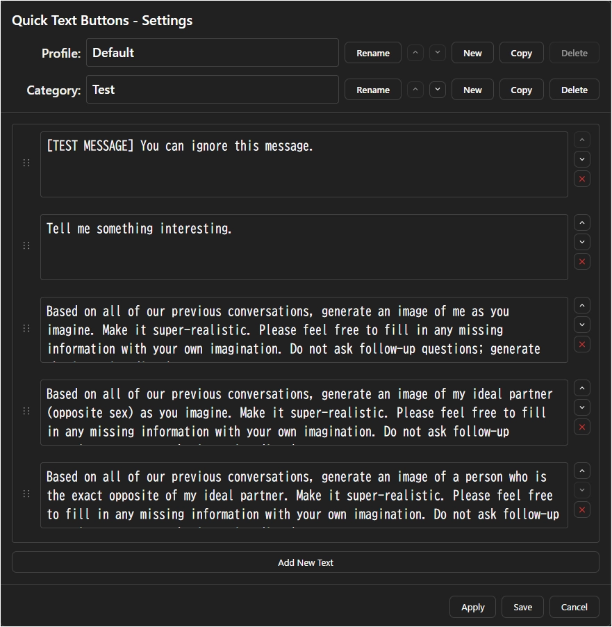

# Quick-Text-Buttons Settings Screen

## Settings Screen

### 1. Click the Quick Text button to open the settings panel

The **Quick Text button** (pen icon) is located at the bottom-left of the chat input field.
Clicking this button opens the settings panel (Hovering over it opens the text insertion list).

Click the button:  

### 2. Settings Panel Items

| Item | Description |
| :--- | :--- |
| **Profile** | Selects the currently active profile (a group of text sets). |
| **Texts** | Opens the "Text Editor Modal" to create, edit, and delete texts. |
| **JSON** | Opens the screen to directly edit, import, and export all settings in JSON format. |
| **Options** | **Settings for text insertion behavior** |
| `Insert newline before text` | Adds one newline character before inserting the text. |
| `Insert newline after text` | Adds one newline character after inserting the text. |
| `Insertion position` | Selects the text insertion position from "Start of the input field," "Current cursor position," or "End of the input field." |

**Note:** The behavior of `Options` settings may not work as expected depending on the state of the input field (e.g., focus state, existing content).
For the most consistent results, it is recommended to turn off the 'Insert newline' options and set the 'Insertion position' to `End`.

### 3. Text Editor Modal Items

| Item | Description |
| :--- | :--- |
| **Profile Management** | |
| `Profile` (dropdown) | Select the profile you want to edit. |
| `Rename`/`▲`/`▼`/`New`/`Copy`/`Delete` | Rename, reorder, create, duplicate, or delete profiles. |
| **Category Management** | |
| `Category` (dropdown) | Within the selected profile, select the category you want to edit. |
| `Rename`/`▲`/`▼`/`New`/`Copy`/`Delete` | Rename, reorder, create, duplicate, or delete categories. |
| **Text List Area** | |
| Text input field | Edit the predefined text you want to insert. You can also reorder items using the drag handle. |
| `Add New Text` | Adds a new text input field to the end of the list. |
| **Footer Buttons** | |
| `Apply` / `Save` | Saves changes. `Apply` keeps the screen open, while `Save` closes it. |