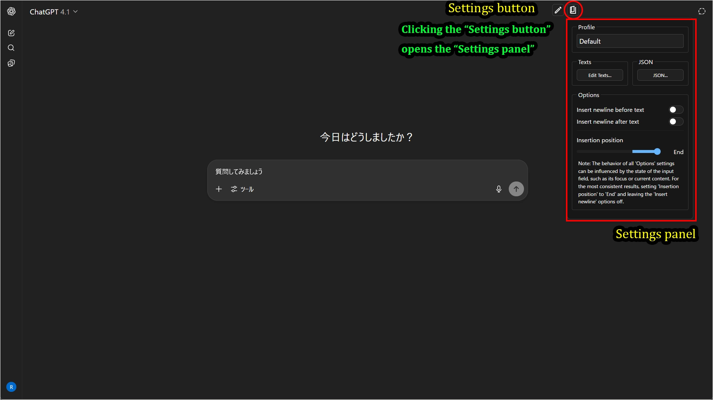

# Quick-Text-Buttons 設定画面

## 設定画面

### 1. 画面右上の設定ボタンをクリックすると設定パネルが開きます

### 2. 設定パネルの項目

| 項目 | 説明 |
| :--- | :--- |
| **Profile** | 現在アクティブなプロファイル（テキストセットのグループ）を選択します。 |
| **Texts** | テキストの作成、編集、削除を行う「テキスト編集モーダル」を開きます。 |
| **JSON** | 全ての設定をJSON形式で直接編集、インポート、エクスポートする画面を開きます。 |
| **Options** | **テキスト挿入時の動作設定** |
| `Insert newline before text` | テキストを挿入する前に改行を1つ追加します。 |
| `Insert newline after text` | テキストを挿入した後に改行を1つ追加します。 |
| `Insertion position` | テキストの挿入位置を「入力欄の先頭(Start)」「現在のカーソル位置(Cursor)」「入力欄の末尾(End)」から選択します。 |

**注意：**`Options`の設定は入力欄の状態によって期待通りに動作しないことがあります（例：フォーカス状態有無や既存の入力内容）。
安定した挙動のために、改行挿入オプションをオフにして、テキスト挿入位置を`End`にすることを推奨します。

### 3. テキスト編集モーダルの項目

| 項目 | 説明 |
| :--- | :--- |
| **プロファイル管理** | |
| `Profile` (プルダウン) | 編集したいプロファイルを選択します。 |
| `Rename`/`▲`/`▼`/`New`/`Copy`/`Delete` | プロファイルの名称変更、順序変更、新規作成、複製、削除を行います。 |
| **カテゴリ管理** | |
| `Category` (プルダウン) | 選択中のプロファイル内で、編集したいカテゴリを選択します。 |
| `Rename`/`▲`/`▼`/`New`/`Copy`/`Delete` | カテゴリの名称変更、順序変更、新規作成、複製、削除を行います。 |
| **テキストリストエリア** | |
| テキスト入力欄 | 挿入したい定型文を編集します。ドラッグハンドルで順序を入れ替えることも可能です。 |
| `Add New Text` | リストの末尾に新しいテキスト入力欄を追加します。 |
| **フッターボタン** | |
| `Apply` / `Save` | 変更を保存します。`Apply`は画面を開いたまま、`Save`は画面を閉じます。 |

