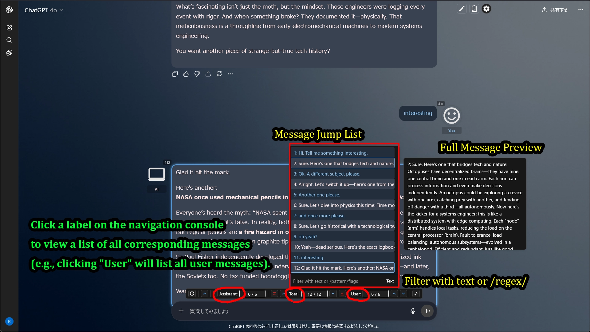

# UX Customizer (for ChatGPT/Gemini)

[日本語のREADMEはこちら。](./README_ja.md)

**For downloads and changelogs, please see the [main README](../../README.md)**

---

## Overview

`UX Customizer` is a script that adds powerful theme and **advanced navigation features** to AI services like ChatGPT and Gemini.  
For each chat, you can flexibly customize **speaker names, icons, text colors, bubbles, backgrounds, and standing images**.  
It also includes convenient UI enhancements such as **message collapsing**, **a searchable message jump list**, and **chat width adjustment**.

Currently, it supports the following AI services.  
The scripts have been created for each site. Please install the required script.

 - **ChatGPT**: **`ChatGPT UX Customizer`** `(GPTUX)`**
 - **Gemini**: **`Gemini UX Customizer`** `(GGGUX)`**

---

## Key Features

* **Intuitive theme editing via GUI**
* Automatically switch themes (color schemes, names, icons, backgrounds, etc.) for specified projects/custom GPTs/chat titles
* **Display "standing images"** for both user and assistant separately on the left and right sides
* **Collapsible messages** (to display long texts compactly)
* **Advanced message navigation** (jump to next/previous/top of message)
* **Integrated navigation console** (displays a consolidated UI for navigation features above the message input field)
* **Message Jump List with Search**: Instantly jump to any message from a list. You can filter messages by text or regular expressions.
* Bulk message collapsing
* Set a maximum width for the entire chat content
* Flexibly specify theme application targets by name or **regular expressions**
* Customize display names, icons, and text colors for user and assistant
* Specify user/assistant icons using SVG, PNG, JPEG, Base64 data, external URLs, etc.
* **Specify local files for images used in themes** (automatically converted to Base64 data)
* Export/import settings (in JSON format)
* **Includes sample settings, making it easy to get started.**
* **[GGGUX only] Auto-load full chat history**: Automatically loads the entire chat history when opening a conversation, eliminating the need to manually scroll up multiple times.  

---

## Screenshots (Images are for ChatGPT)

### 1. Example of a default theme applied when no specific project theme matches.

### 2. You can create as many themes as you want for specific project/custom GPT/chat names.

### 3. Another theme example.

### 4. You can even do this by using standing images and icons.

### 5. Conversations with your personal assistant become more engaging. (The image below is the author's personal assistant)

### 6. Example of customizable items

### 7. UI Enhancement Features (Collapsible Messages / Message Navigation / Scroll to Top)

### 8. Advanced Navigation (Jump List with Filter)

### 9. Differences between the navigation consoles of GPTUX and GGGUX

##### GPTUX (for ChatGPT)
  - The left end button is the "Rescan DOM for messages" function  
  Normally, there is no need to use this because DOM scanning is performed automatically when loading chat. Use this if the message count is not being obtained correctly for messages that contain images.

##### GGGUX (for Gemini)
  - The left end button is the "Load full chat history (Auto scroll)" function  
  This button is designed to allow you to manually auto-scroll specific chats while normally disabling the `Load full history on chat load` function.

---

## How to Use

* Click the **gear icon** in the upper right corner to **open the Settings Panel**.
* From the Settings Panel, you can change various options or **open the Theme Editor (GUI) to create and edit themes**.
* In the navigation console above the input field, **click on the "Assistant:", "Total:", or "User:" labels** to open the message **Jump List**.
* If needed, use the "JSON" button to export your current settings or import sample settings.

---

## Sample Settings

The easiest way to get started is to import the [sample file](https://raw.githubusercontent.com/p65536/AI-UX-Customizer/main/samples/UX-Customizer/theme_presets.json) and modify its theme settings.
Please import the sample JSON from the link above via the script's settings screen. Note that the samples use public SVG icons from [Google Fonts](https://fonts.google.com/icons).

After applying the settings, the `defaultSet` configuration from the sample settings should be applied.

Next, to check the theme application for a specific project/custom GPT/chat, try the following:

* Start a chat name with `[Theme1]` -> The theme for `[Theme1]` will be applied.
* Start a chat name with `[Theme2]` -> The theme for `[Theme2]` will be applied.
* Start a chat name with `[Game]` -> The theme for `[Game]` will be applied.

The samples include one default theme and three specific themes.
Try modifying these settings to your liking. The GUI theme editor makes it easy to make changes.

---

## Settings Details

-   [Settings Screen](./settings.md)
-   [Configuration Properties](./manual_json.md)

---

## Recommended Usage & Customization

  * Enhance the feeling of a personal assistant by setting custom icons and names.
  * Visually distinguish what you are working on by changing text colors and icons for each project.
  * Set up character profiles for multiple work projects or TRPG sessions.
  * Express your personality with custom icons or SVGs from Google Fonts.
  * Flexibly match theme application targets with regular expressions.

## Notes & Limitations

  * **You can specify local images for image fields in theme settings, but please do not overuse this feature.** It can lead to bloated configuration JSON and degraded performance. Whenever possible, specify online resources. The main purpose of this feature is to easily check how your local images appear when applied to a theme. While it can also be used for images you prefer not to host online, please limit its use to around 3-5 themes.
  * This script uses the special permission `GM_xmlhttpRequest` to load external resources (such as background and standing images) without being restricted by a website's Content Security Policy (CSP). When loading images from external sites, a dialog requesting access permission for the content will appear, so please approve it for use.
  * **If the AI service's UI or page structure undergoes major changes, the script may stop working.**
  * It has been tested on Firefox. It has also been confirmed to work on Chrome-based browsers, but less extensively.
  * Only the latest version of each script is provided. Past versions can be referenced from Git history. This repository does not use release or tag features.

-----

## License

MIT License

-----

## Author

  * [p65536](https://github.com/p65536)

-----

## Known Issues

  * No consideration for UI when using Canvas features.

## Future Plans

### High Priority (Items the author wants to implement)

  * Additional UI adjustments when using Canvas (e.g., how the navigation console is displayed)
  
### Low Priority (Items under consideration but not deemed necessary at present)

  * Cloud-based settings synchronization (local management via export/import is sufficient).
  * Theme application to the sidebar.
  * Font changes for the input area.
  * On/off switch for theme application to the toolbar area (the top area with project name, chat title, account icon, etc.) (Initially, the toolbar was excluded from theme application, but it stood out more than expected, so it's now fully applied).
  * Applying themes to Canvas
