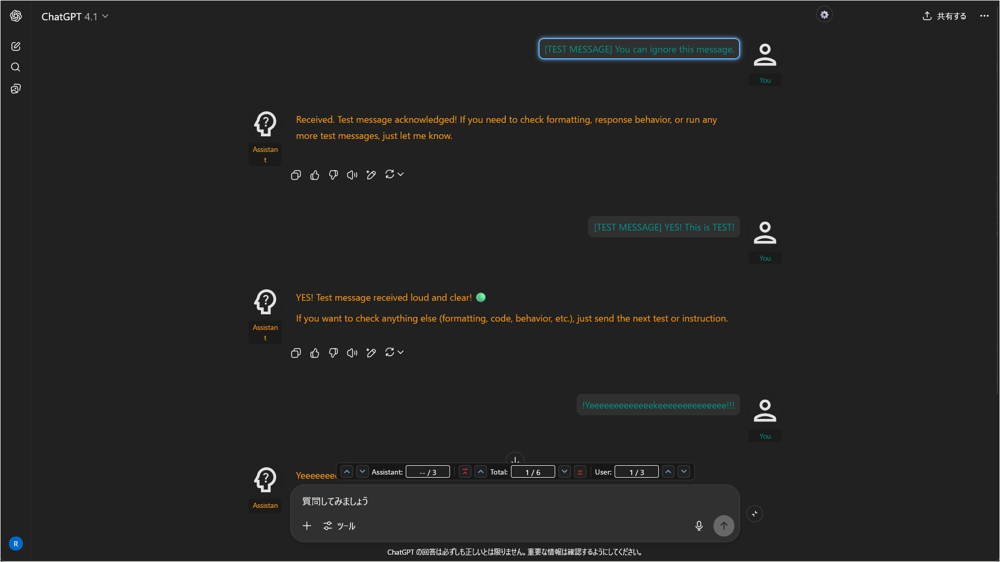
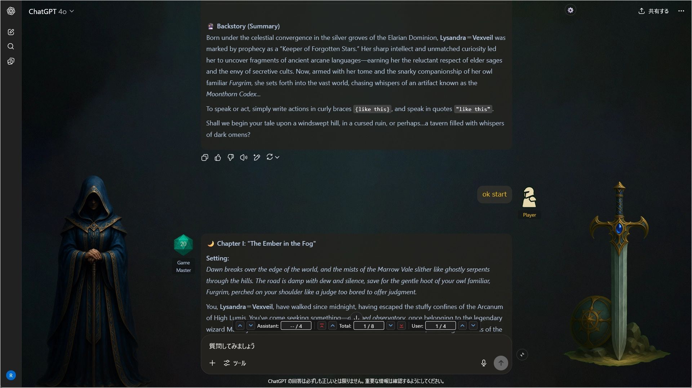
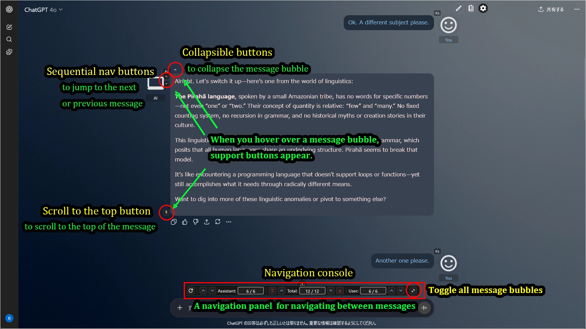

# UX Customizer (for ChatGPT/Gemini)

[English README is here.](./README.md)

**ダウンロードや更新履歴は[トップページ](../../README_ja.md)から**

---

## 概要

`UX Customizer`は、ChatGPTやGeminiなどのAIサービスに、強力なテーマ機能とナビゲーション機能を追加するスクリプトです。  
チャットごとに、**話者名、アイコン、文字色、吹き出し、背景、立ち絵**などを柔軟にカスタマイズできます。  
さらに、**メッセージの折りたたみ**や**メッセージ間の移動**、**チャット幅変更**などの便利なUI改善機能も搭載しています。

現在は以下のAIサービスに対応しています。  
スクリプトはサイト別に作成しました。必要なスクリプトをインストールしてください。

 - **ChatGPT** : **`ChatGPT UX Customizer`**
 - **Gemini** : **`Gemini UX Customizer`**

---

## 主な機能

* **GUIによる直感的なテーマ編集機能**
* 指定のプロジェクト/カスタムGPT/チャット名ごとにテーマ（配色、名前、アイコン、背景など）を自動切替
* ユーザー／アシスタントそれぞれの **「立ち絵（スタンディングイメージ）」を左右に別々に表示可能**
* **メッセージの折りたたみ機能**（長文をコンパクトに表示）
* **メッセージ間のナビゲーション機能**（次/前/先頭へジャンプ）
* **統合ナビゲーションコンソール機能**（メッセージ入力欄上部にナビ関連機能をまとめたUIを表示）
* 全メッセージの一括折りたたみ機能
* チャット全体の最大幅を指定可能
* テーマ適用先を名前や**正規表現**で柔軟に指定
* ユーザー／アシスタントの表示名・アイコン・文字色をカスタマイズ可能
* ユーザー／アシスタントのアイコンをSVG・PNG・JPEG・Base64データ・外部URL等で指定可能
* **テーマで使用する画像にローカルファイルを指定可能**（自動でBase64データに変換）
* 設定をエクスポート／インポート可能（JSON形式）
* **設定サンプルあり。すぐに使い始めることができます**

---

## 実行イメージ（画像はChatGPTの場合）

### 1. テーマ適用例(特定のプロジェクトに紐付かない場合に適用されるデフォルトテーマを設定可能)

### 2. 特定のプロジェクト名/カスタムGPT名/チャット名に適用するテーマをいくつでも作成可能

### 3. 別のテーマ例

### 4. "立ち絵"やアイコンを活用すればこんなこともできる

### 5. パーソナルアシスタントとの会話も捗る(以下の画像は作者のパーソナルアシスタント)

### 6. カスタマイズ可能項目の例

### 7. UI改善機能（メッセージ折りたたみ／メッセージ間移動／メッセージ先頭に移動）

---

## 使い方

* 画面右上の歯車アイコンから**設定画面を開く**
* 設定パネルから各種オプションを変更したり、**テーマエディタ(GUI)を開いてテーマを作成・編集**できます。
* 必要に応じて"JSON"ボタンで、現在の設定をエクスポートしたり、サンプル設定をインポートしたりしてください。

---

## サンプル設定

一番簡単な始め方は、[サンプル](https://raw.githubusercontent.com/p65536/AI-UX-Customizer/main/samples/UX-Customizer/theme_presets.json)をコピーして、テーマ設定を変更してみることです。  
上記リンクのサンプルJSONを、スクリプトの設定画面でインポートしてください。なおサンプルでは [Google Fonts](https://fonts.google.com/icons) の公開SVGアイコンを利用しています。

設定適用後、サンプル設定の`defaultSet`の設定が適用されるはずです。

では次に特定のプロジェクト／カスタムGPT／チャットに対するテーマ適用を確認するために、以下を試してください。

* チャット名を`[Theme1]`で始まる名前にする->`[Theme1]`用のテーマが適用される
* チャット名を`[Theme2]`で始まる名前にする->`[Theme2]`用のテーマが適用される
* チャット名を`[Game]`で始まる名前にする->`[Game]`用のテーマが適用される

サンプルで用意しているテーマは default(1) + 特定テーマ(3) の4つです。  
まずはこれらの設定内容を好きな値に書き換えてみてください。GUI設定画面で手軽に変更出来ます。

---

## 設定詳細

- [設定画面](./settings_ja.md)
- [設定項目](./manual_json_ja.md)

---

## 推奨運用・カスタマイズ例

  * アイコンや名前を設定することで自分専用アシスタント感倍増
  * プロジェクトやチャットごとに文字色やアイコンが変わることで、現在何をしているか視覚的に分かりやすくなる
  * 複数業務プロジェクト・TRPGセッションごとにキャラクター設定
  * 自作アイコンやGoogle FontsのSVG利用による個性演出
  * テーマを適用先を正規表現で柔軟にマッチできる

## 注意事項・制限

  * **テーマ設定で画像項目にローカル画像を指定できますが、多用しないでください。** 設定JSONの肥大化やパフォーマンス低下を招きます。可能な限りオンラインのリソースを指定してください。本機能の主な用途は、手持ちの画像をテーマ設定した場合にどう見えるかを手軽に確認することです。あるいはオンラインに置きたくない画像をテーマ設定したい場合にも使えますが、3~5テーマくらいでの使用に留めてください。
  * 本スクリプトは、ウェブサイトのCSP（Content Security Policy）に制限されずに外部リソース（背景画像や立ち絵画像など）を読み込むために、`GM_xmlhttpRequest`権限を利用しています。外部サイトの画像を読み込む際に、コンテンツへのアクセス許可を求めるダイアログが表示されますので、許可してご利用ください。
  * **AIサービス側のUIやページ構造が大幅に変更された場合、動作しなくなる可能性があります。**
  * Firefoxで動作確認しています。Chrome系ブラウザでも一応動作確認していますが、Firefoxほどには確認していません。
  * 各スクリプトの最新版のみを掲載しています。過去バージョンは Git の履歴から参照してください。本レポジトリではリリース・タグ機能は使用しません。

-----

## ライセンス

MIT License

-----

## 作者

  * [p65536](https://github.com/p65536)

-----

## 既知の問題

  * [ChatGPT] チャット幅設定を変更すると、メッセージ入力欄の幅も連動して変更される（ページ構造上、うまく調整できずに苦戦中）
  * Canvas機能利用時のUIを何も考慮していない。

## 今後の予定

### 優先的に検討中の項目（作者が実装したいと考えている）
  * Canvas利用時の追加UI調整（ナビコンソールの表示方法など）
  
### 検討はしているが、現状では必要性を感じていない項目

  * クラウド経由での設定同期（export/importによるローカル管理で十分）
  * サイドバーへのテーマ適用
  * 入力エリアのフォント変更
  * ツールバー（画面上部のプロジェクト名やチャット名、アカウントアイコン等が表示されるエリア）へのテーマ適用on/off切り替え（初めはツールバーを除外してテーマ適用していたのだが、思ったよりツールバーが目立つから今のように全面適用にした）
  * Canvasへのテーマ適用
