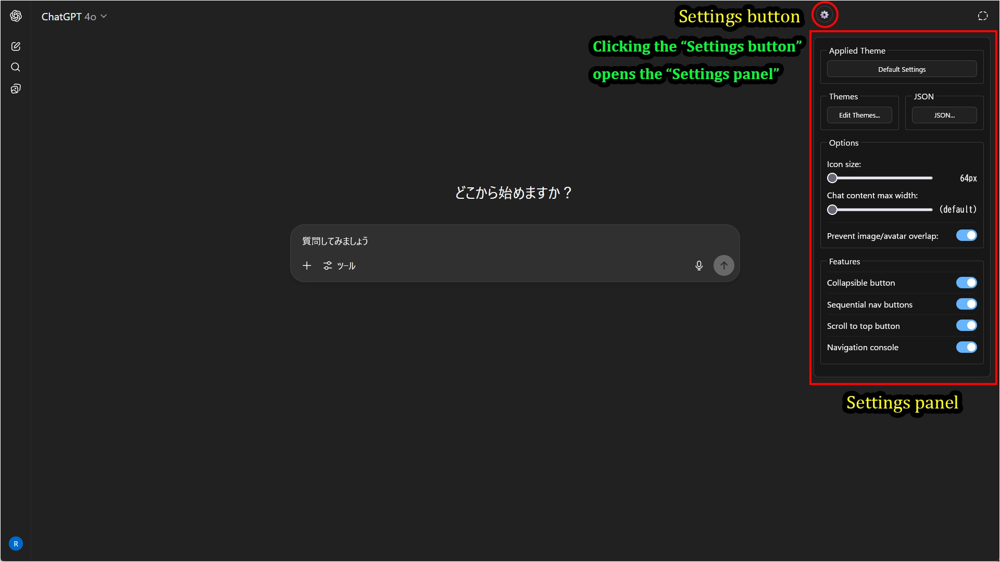
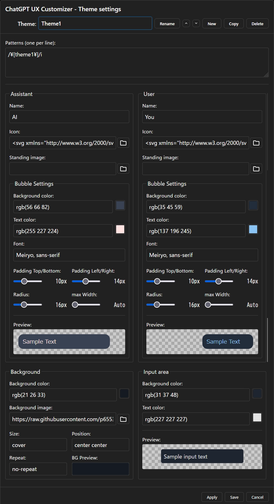

# AI UX Customizer Settings Screen

## Settings Panel

Access global options and feature toggles from one panel.  
For creating and editing specific visual themes (colors, backgrounds, standing images), use the **Theme Editor** (Theme settings), accessible via the "Edit Themes..." button in this panel.

### 1. You can access the Settings Panel by clicking the "Settings" button (gear icon) added to the screen.

### 2. Settings Panel Items

| ChatGPT | Gemini |
| :--- | :--- |
| The `Load full history on chat load` setting does not exist. | The `Load full history on chat load` setting exists. |
|  |  |

| Item | Description |
| :--- | :--- |
| **Applied Theme** | The name of the theme currently applied to the chat. Click to edit this theme directly. |
| **Themes** | Opens the **Theme Editor** to create, edit, and delete themes. |
| **JSON** | Opens the screen to directly edit, import, and export all settings in JSON format. |
| **Icon size** | Changes the size of the user and assistant avatar icons displayed on the left and right sides of the screen. |
| **Chat content max width** | Adjusts the maximum display width for the entire conversation. Setting it to the far left will use the platform's default width. |
| **Prevent image/avatar overlap** | When ON, the display area will automatically adjust so that standing images do not overlap avatar icons. |
| **[GPTUX only]** **Scan layout on chat load** | **[ChatGPT only] (Firefox only)** Automatically scans the chat layout when opening a chat. When using Firefox, scrolling may feel rubbery due to delayed layout calculations. Enabling this option runs an automatic "layout scan" on chat load to pre-calculate element heights and reduce the issue. It can also be triggered manually via the "Layout Scan" button (the left end button on navigation console). |
| **[GGGUX only]** **Load full history on chat load** | **[Gemini only]** Automatically loads the entire chat history when opening a chat. It can also be triggered manually via the "Load full chat history" button (the left end button on navigation console). |
| **[GPTUX only]** **Show timestamp** | **[ChatGPT only]** Displays the creation time for each message. (This feature is not available for Gemini as it is technically difficult to retrieve timestamps.) |
| **Collapsible button** | Adds a button to each message to collapse long messages. |
| **Sequential nav buttons** | Adds buttons to each message to jump to the next/previous message by the same speaker (user/assistant). |
| **Scroll to top button** | Adds a button to each message to scroll to the top of that message. |
| **Navigation console** | Displays an operation panel above the text input field for quick navigation between messages. |

### 3. Theme Settings Screen Items

A GUI editor allows for intuitive customization of all visual elements, including colors, fonts, backgrounds, and standing images.

| Item | Description |
| :--- | :--- |
| **Theme Management** | |
| `Theme` (dropdown) | Select the theme you want to edit. `Default Settings` is the base setting for all themes. |
| `Rename` | Changes the name of the selected theme. Clicking this enables inline editing. |
| `▲` / `▼` | Moves the theme's priority. Patterns of themes higher in the list are evaluated first. |
| `New` / `Copy` / `Delete` | Respectively, "Create new," "Duplicate," and "Delete" a theme. |
| **General Settings** | |
| `Patterns` | The theme is automatically applied if the chat title matches this regular expression pattern. |
| **Assistant / User** | *(Assistant and User settings are common)* |
| `Name` | The speaker's name displayed on the chat screen. If left blank, the default name will be used. |
| `Icon` | Specifies the speaker's avatar icon using a URL, Data URI, or SVG string. |
| `Standing image` | Specifies the character's standing image displayed on the left and right sides of the screen, using a URL or Data URI. |
| `Bubble Settings` | **Message bubble style** |
| `Background color` | The background color of the bubble. |
| `Text color` | The text color inside the bubble. |
| `Font` | Specifies the font inside the bubble. |
| `Padding` | Adjusts the top/bottom and left/right inner padding of the bubble. |
| `Radius` | Adjusts the roundness of the bubble's corners. |
| `max Width` | Specifies the maximum width of the bubble as a percentage of the screen width. |
| **Background (Window Background)** | |
| `Background color` | The background color of the entire chat window. |
| `Background image` | The background image of the entire chat window. |
| `Size / Position / Repeat` | Sets the size, display position, and repeat option for the background image. |
| **Input area (Input Area)** | |
| `Background color` | The background color of the message input field. |
| `Text color` | The text color of the message input field. |
| **Footer Buttons** | |
| `Apply` / `Save` | Saves changes. `Apply` keeps the screen open, `Save` closes the screen. |