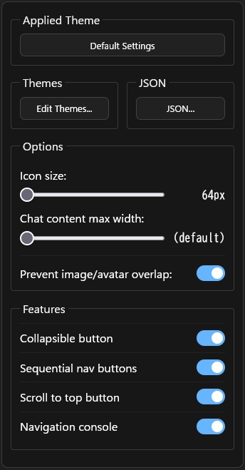
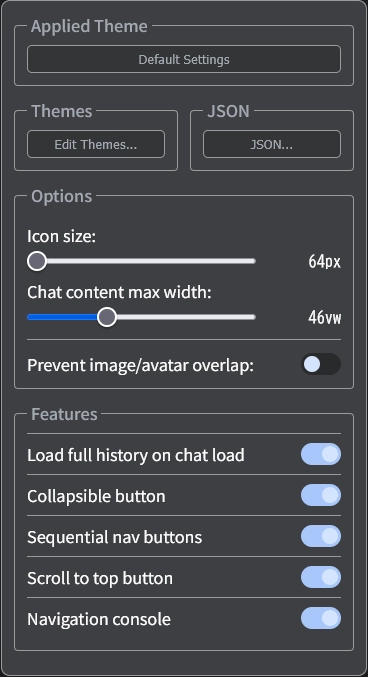

# AI UX Customizer 設定画面

## 設定画面

### 1. 画面右上の設定ボタンをクリックすると設定パネルが開きます

### 2. 設定パネルの項目

| ChatGPT | Gemini |
| :--- | :--- |
| `Load full history on chat load` 設定なし | `Load full history on chat load` 設定あり |
|  |  |

| 項目 | 説明 |
| :--- | :--- |
| **Applied Theme** | 現在のチャットに適用されているテーマ名です。クリックするとこのテーマを直接編集できます。 |
| **Themes** | テーマの作成、編集、削除を行う「テーマエディタ」を開きます。 |
| **JSON** | 全ての設定をJSON形式で直接編集、インポート、エクスポートする画面を開きます。 |
| **Icon size** | 画面左右に表示されるユーザーとアシスタントのアバターアイコンの大きさを変更します。 |
| **Chat content max width** | 会話全体の表示幅（最大幅）を調整します。左端にするとプラットフォームのデフォルト幅になります。 |
| **Prevent image/avatar overlap** | ONにすると、立ち絵がアバターアイコンに重ならないよう、表示領域を自動で調整します。 |
| **[Geminiのみ]** **Load full history on chat load** | **[Geminiのみ]** チャットを開いた際に全履歴を自動で読み込む機能。 |
| **Collapsible button** | 長いメッセージを折りたたむためのボタンを、各メッセージに追加します。 |
| **Sequential nav buttons** | 同じ話者（ユーザー/アシスタント）の前後の発言へジャンプするボタンを、各メッセージに追加します。 |
| **Scroll to top button** | そのメッセージの先頭までスクロールするボタンを、各メッセージに追加します。 |
| **Navigation console** | メッセージ間を素早く移動できる操作パネルを、テキスト入力欄の上部に表示します。 |

### 3. テーマ設定画面の項目

| 項目 | 説明 |
| :--- | :--- |
| **テーマ管理** | |
| `Theme` (プルダウン) | 編集したいテーマを選択します。`Default Settings`は全テーマの基本設定です。 |
| `Rename` | 選択中のテーマの名前を変更します。クリックすると、テーマ名をその場で編集できます。 |
| `▲` / `▼` | テーマの優先順位を移動します。上にあるテーマのパターンが先に評価されます。 |
| `New` / `Copy` / `Delete` | それぞれテーマの「新規作成」「複製」「削除」を行います。 |
| **一般設定** | |
| `Patterns` | チャットのタイトルがこの正規表現パターンに一致した場合に、テーマを自動適用します。 |
| **Assistant / User** | *(アシスタントとユーザーの設定項目は共通です)* |
| `Name` | チャット画面で表示される話者の名前です。空にするとデフォルト名が使われます。 |
| `Icon` | 話者のアバターアイコンをURL、Data URI、またはSVG文字列で指定します。 |
| `Standing image` | 画面の左右に表示されるキャラクターの立ち絵をURLまたはData URIで指定します。 |
| `Bubble Settings` | **メッセージ吹き出しのスタイル** |
| `Background color` | 吹き出しの背景色です。 |
| `Text color` | 吹き出し内の文字色です。 |
| `Font` | 吹き出し内のフォントを指定します。 |
| `Padding` | 吹き出し内部の上下・左右の余白を調整します。 |
| `Radius` | 吹き出しの角の丸み具合を調整します。 |
| `max Width` | 吹き出しの最大幅を、画面幅に対するパーセンテージで指定します。 |
| **Background (ウィンドウ背景)** | |
| `Background color` | チャットウィンドウ全体の背景色です。 |
| `Background image` | チャットウィンドウ全体の背景画像です。 |
| `Size / Position / Repeat` | 背景画像のサイズ、表示位置、繰り返しの有無を設定します。 |
| **Input area (入力エリア)** | |
| `Background color` | メッセージ入力欄の背景色です。 |
| `Text color` | メッセージ入力欄の文字色です。 |
| **フッターボタン** | |
| `Apply` / `Save` | 変更を保存します。`Apply`は画面を開いたまま、`Save`は画面を閉じます。 |
